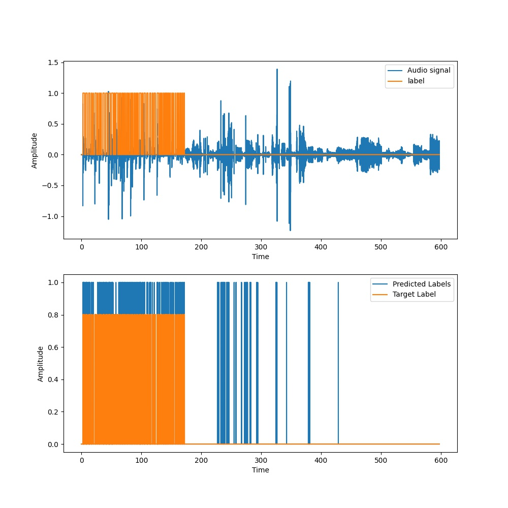
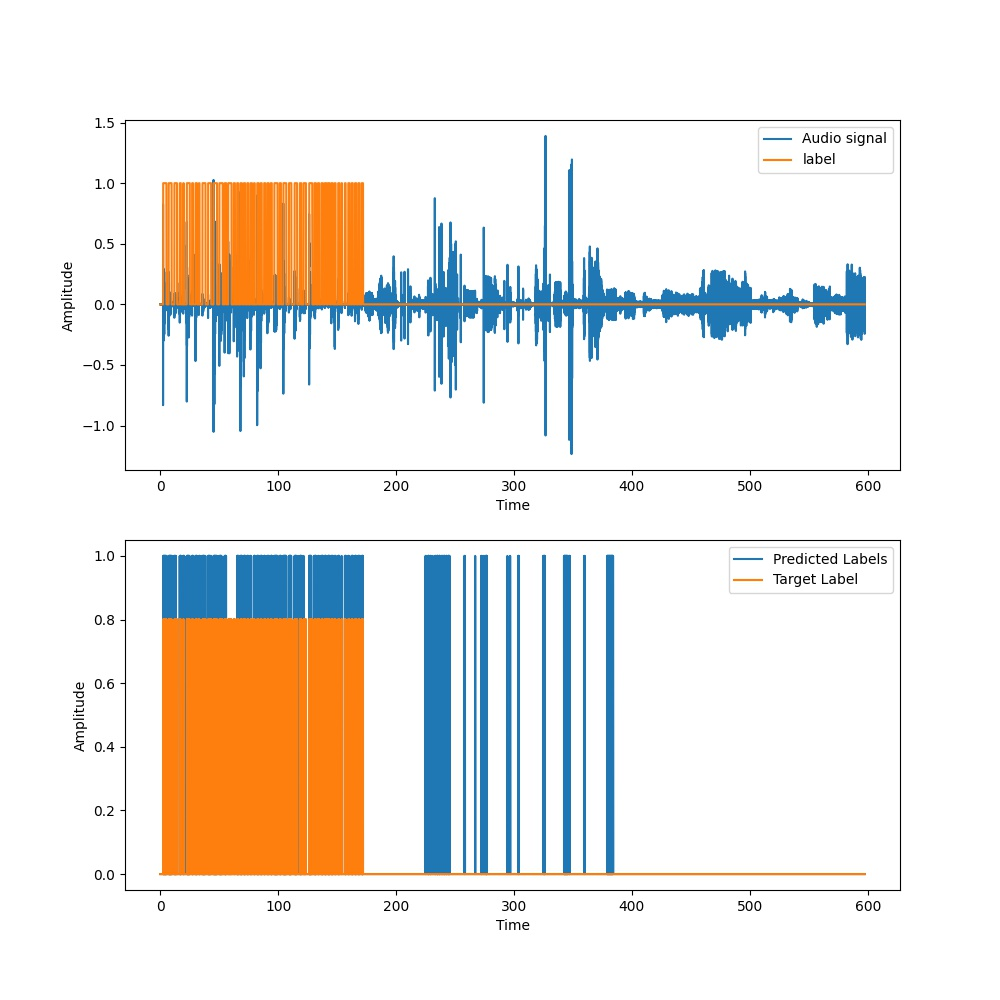
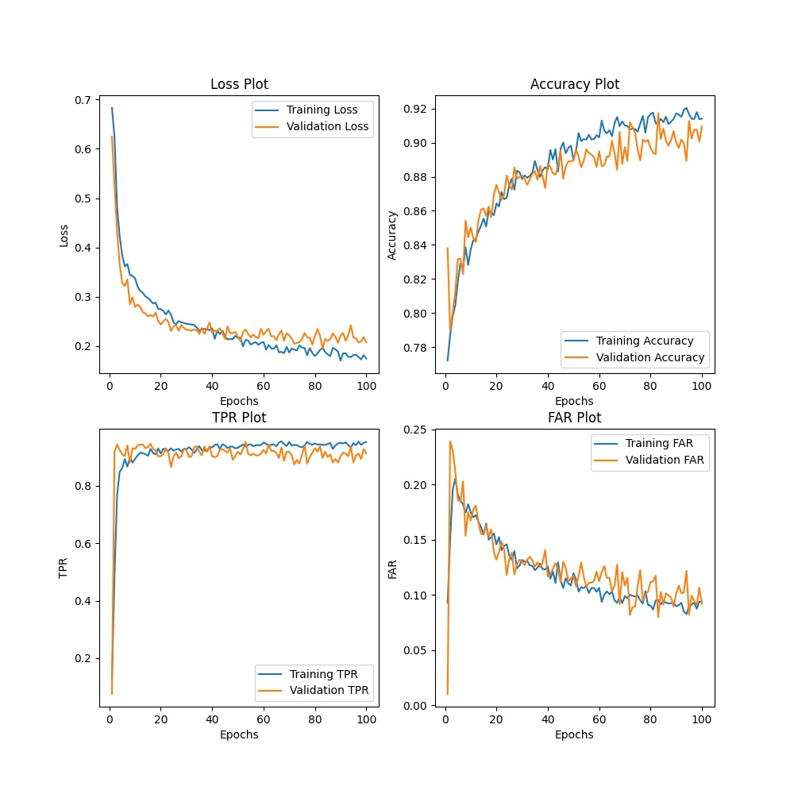
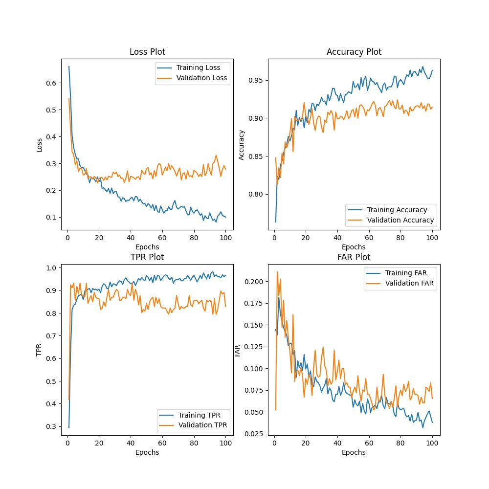
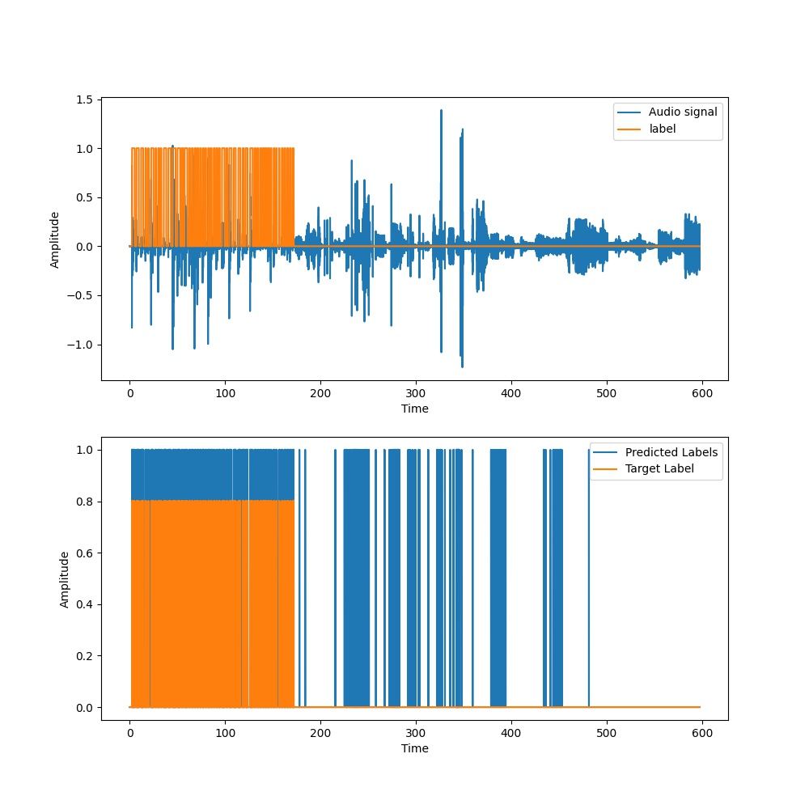
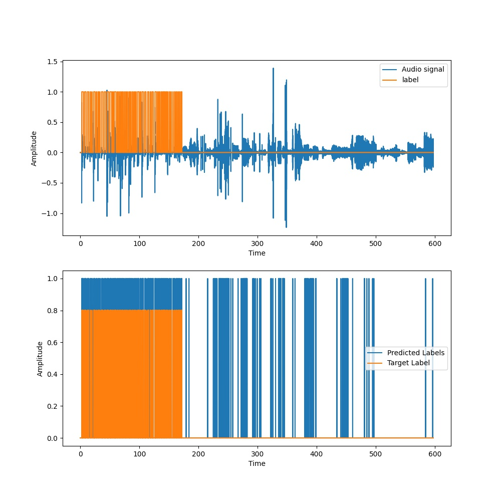
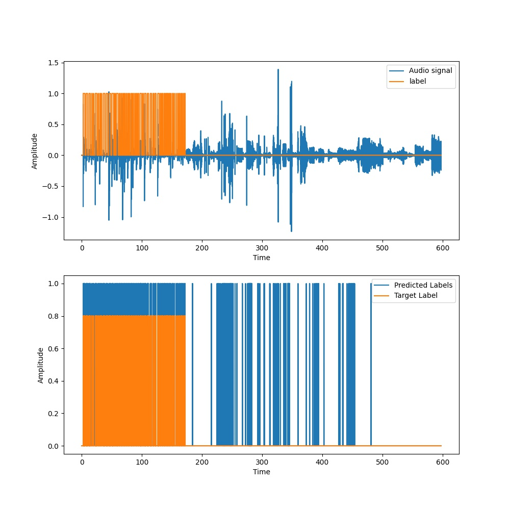
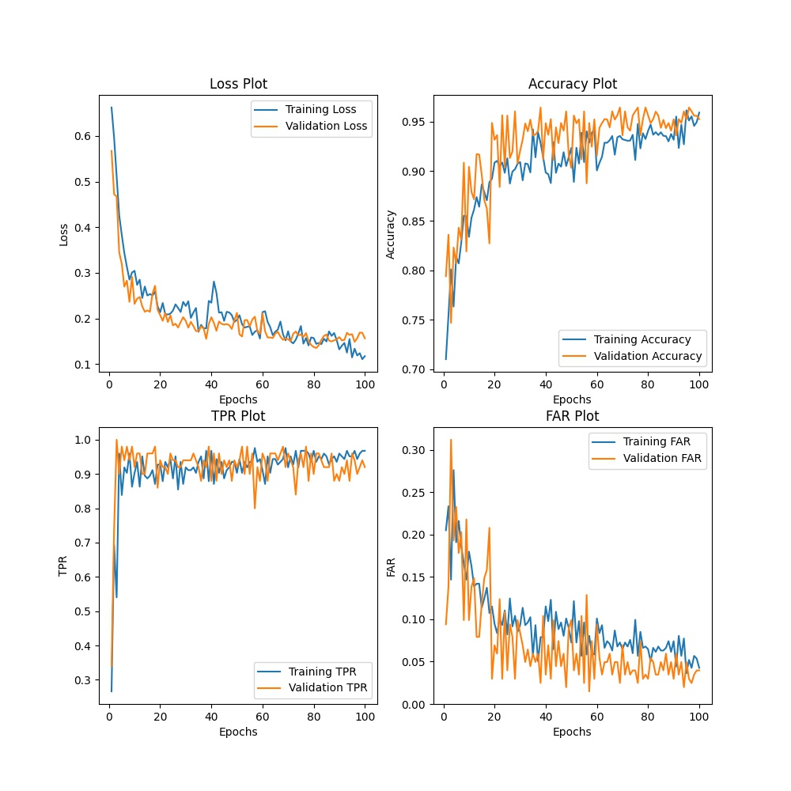

# Result 4: Changed sampling rate to 16kHz
T - Duration of each clip over which features are extracted  
N - Number of MFCC features for each clip  
Fs = 16kHz

Changed the sampling frequency to 16kHz and trained model for T = 50ms, T = 100ms, T = 150ms and T = 200ms. The data was again fed in the order in which the data occurs in the original audio file and the model was trained. Here we notice that the number of features reduced for different values of T compared to that for 22KHz. The results were similar to the one before. 

<table>
  <tr>
    <td>T = 50ms, N = 100</td>
     <td>T = 50ms, N = 100</td>
  </tr>
  <tr>
    <td></td>
    <td></td>
  </tr>
 </table>
 
 <table>
  <tr>
    <td>T = 100ms, N = 200</td>
     <td>T = 100ms, N = 200</td>
  </tr>
  <tr>
    <td></td>
    <td></td>
  </tr>
 </table>
 
 <table>
  <tr>
    <td>T = 150ms, N = 250</td>
     <td>T = 150ms, N = 250</td>
  </tr>
  <tr>
    <td></td>
    <td></td>
  </tr>
 </table>
 
 <table>
  <tr>
    <td>T = 200ms, N = 350</td>
     <td>T = 200ms, N = 350</td>
  </tr>
  <tr>
    <td></td>
    <td></td>
  </tr>
 </table>
 
# Result 3: Feed the data to the model in sequential format
T - Duration of each clip over which features are extracted  
N - Number of MFCC features for each clip  
Fs = 22kHz (librosa default- did not notice it until later)

Until now the data was shuffled before it was fed to the model for training. Now we maintain the order in which the data occurs in the original audio file and train the model. Trained the model only for T = 50ms, T = 100ms and T = 150ms gave the best results in the previous experiment.  
Here we also notice that as the FAR decreases so does the TPR.

<table>
  <tr>
    <td>T = 50ms, N = 150</td>
     <td>T = 50ms, N = 150</td>
  </tr>
  <tr>
    <td></td>
    <td></td>
  </tr>
 </table>
 
 <table>
  <tr>
    <td>T = 100ms, N = 250</td>
     <td>T = 100ms, N = 250</td>
  </tr>
  <tr>
    <td></td>
    <td></td>
  </tr>
 </table>
 
 <table>
  <tr>
    <td>T = 150ms, N = 350</td>
     <td>T = 150ms, N = 350</td>
  </tr>
  <tr>
    <td></td>
    <td></td>
  </tr>
 </table>
 
# Result 2: Experiment with different time duration of audio clips
T - Duration of each clip over which features are extracted  
N - Number of MFCC features for each clip  
Fs = 22kHz (librosa default- did not notice it until later)

Experimented with different duration of the audio clip ie., value of T. T = 50ms, T = 100ms and T = 150ms gave the best results.  
Trained the model for only 100 epochs as it might start overfitting beyond that.

 <table>
  <tr>
    <td>T = 10ms, N = 50</td>
     <td>T = 10ms, N = 50</td>
  </tr>
  <tr>
    <td></td>
    <td></td>
  </tr>
 </table>
 
 <table>
  <tr>
    <td>T = 20ms, N = 50</td>
     <td>T = 20ms, N = 50</td>
  </tr>
  <tr>
    <td></td>
    <td></td>
  </tr>
 </table>

<table>
  <tr>
    <td>T = 50ms, N = 150</td>
     <td>T = 50ms, N = 150</td>
  </tr>
  <tr>
    <td></td>
    <td></td>
  </tr>
 </table>
 
 <table>
  <tr>
    <td>T = 70ms, N = 200</td>
     <td>T = 70ms, N = 200</td>
  </tr>
  <tr>
    <td></td>
    <td></td>
  </tr>
 </table>
 
 <table>
  <tr>
    <td>T = 100ms, N = 250</td>
     <td>T = 100ms, N = 250</td>
  </tr>
  <tr>
    <td></td>
    <td></td>
  </tr>
 </table>
 
 <table>
  <tr>
    <td>T = 150ms, N = 350</td>
     <td>T = 150ms, N = 350</td>
  </tr>
  <tr>
    <td></td>
    <td></td>
  </tr>
 </table>
 
# Result 1: Experiment with different number of MFCC features
T - Duration of each clip over which features are extracted  
N - Number of MFCC features for each clip  
Fs = 22kHz (librosa default- did not notice it until later)

Experimented with different values of T and N. We can see from the figures below, higher the number of features per data point better the results. Hence tested the model on the test audio clip for N = 50(for 10ms and 20 ms) and N = 150 (for 50ms as MFCC function in librosa generated 3x50 features for a 50ms clip).  

<table>
  <tr>
    <td>T = 10ms, N = 20</td>
     <td>T = 10ms, N = 50</td>
     <td>T = 10ms, N = 50</td>
  </tr>
  <tr>
    <td></td>
    <td></td>
    <td></td>
  </tr>
 </table>
 
 
 <table>
  <tr>
    <td>T = 20ms, N = 20</td>
     <td>T = 20ms, N = 50</td>
     <td>T = 20ms, N = 50</td>
  </tr>
  <tr>
    <td></td>
    <td></td>
    <td></td>
  </tr>
 </table>
 
 <table>
  <tr>
    <td>T = 50ms, N = 150</td>
     <td>T = 50ms, N = 150</td>
  </tr>
  <tr>
    <td></td>
    <td></td>
  </tr>
 </table>

