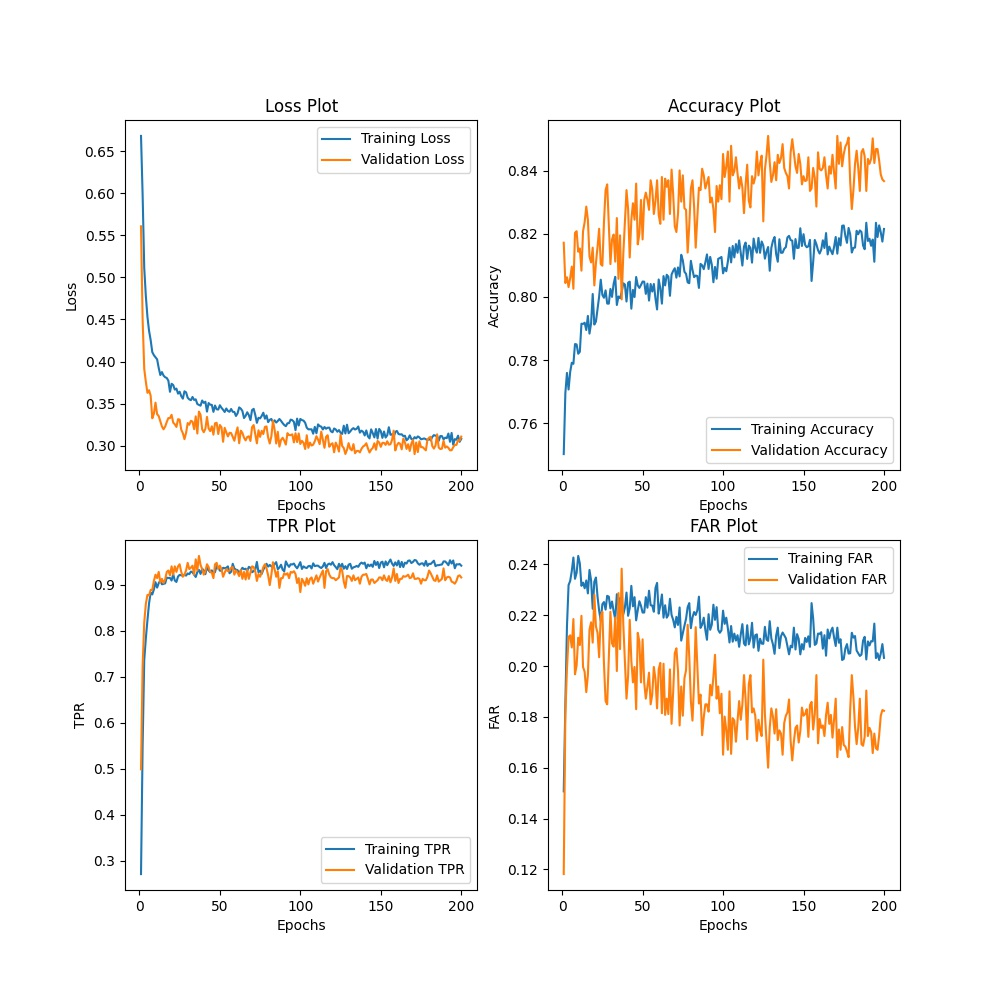
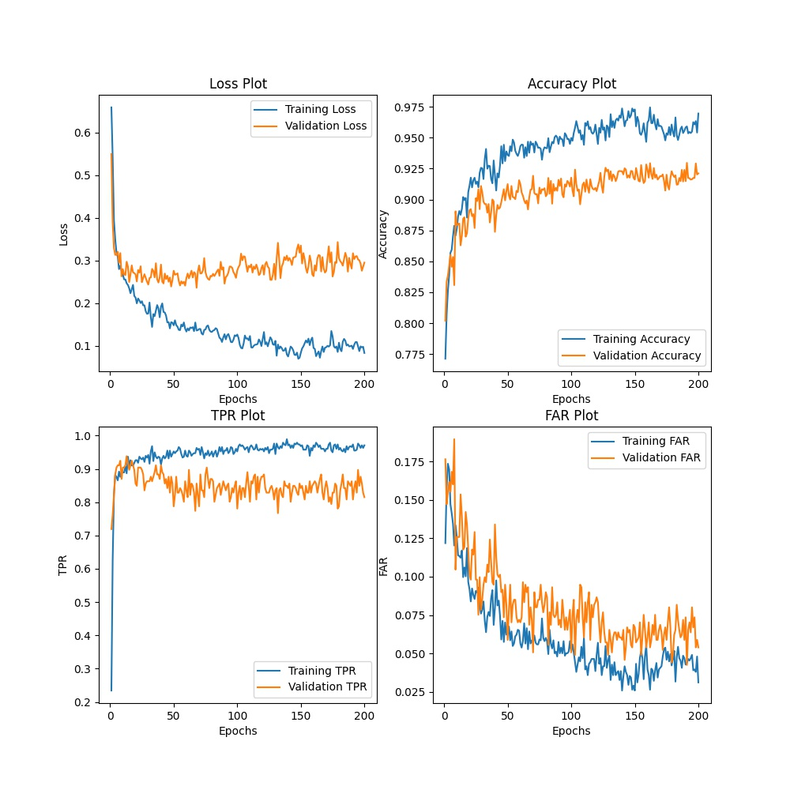
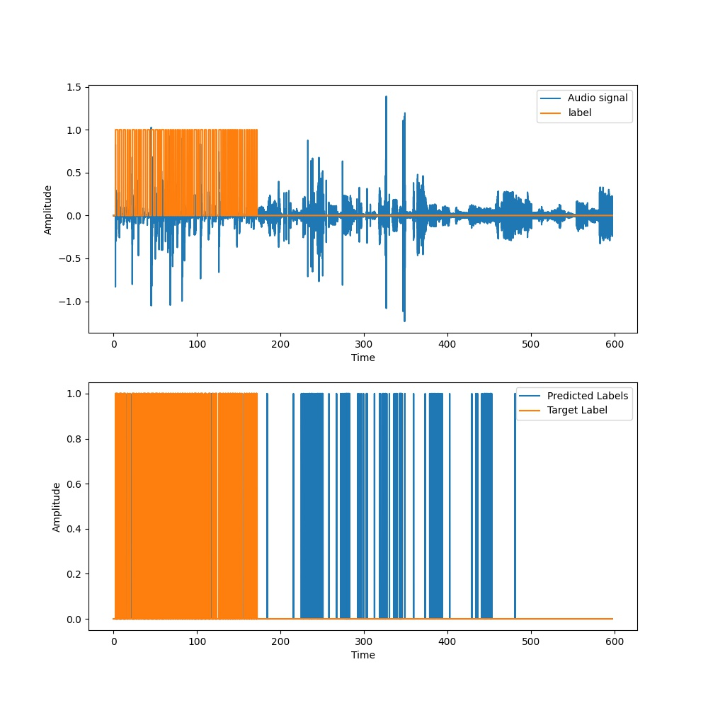

Metrics | T = 10ms, N = 50 | T = 20ms, N = 50 | T = 50ms, N = 150 
:------:|:----------------:|:----------------:|:--------------:
Loss | 0.27394 | 0.21078 | 0.32435
Accuracy | 0.90599 | 0.91351 | 0.93089
TPR | 0.78677 | 0.83504 | 0.78355
FAR | 0.077137 | 0.075411 | 0.048347

<table>
  <tr>
    <td>T = 10ms, N = 20</td>
     <td>T = 10ms, N = 50</td>
     <td>T = 10ms, N = 50</td>
  </tr>
  <tr>
    <td></td>
    <td></td>
    <td></td>
  </tr>
 </table>
 
 
 <table>
  <tr>
    <td>T = 20ms, N = 20</td>
     <td>T = 20ms, N = 50</td>
     <td>T = 20ms, N = 50</td>
  </tr>
  <tr>
    <td></td>
    <td></td>
    <td></td>
  </tr>
 </table>
 
 <table>
  <tr>
    <td>T = 50ms, N = 150</td>
     <td>T = 50ms, N = 150</td>
  </tr>
  <tr>
    <td></td>
    <td></td>
  </tr>
 </table>

