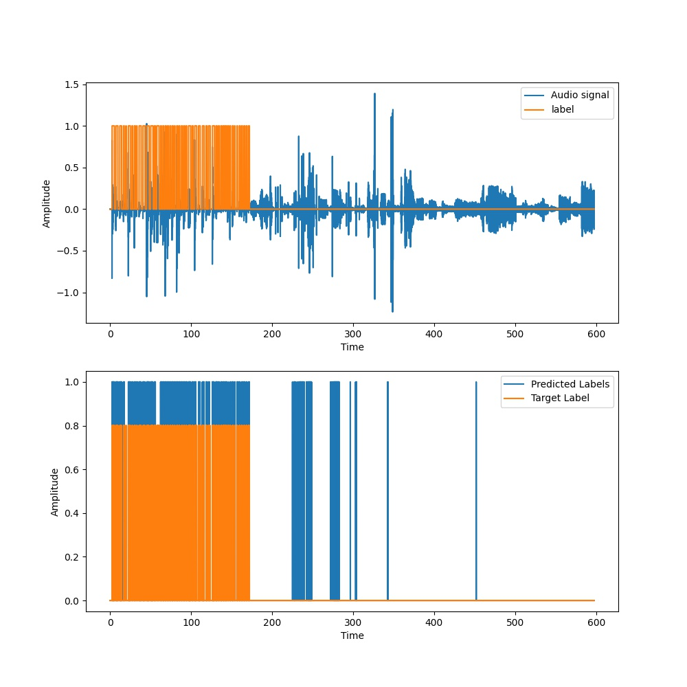

Metrics | T = 50ms, N = 150 | T = 100ms, N = 250 | T = 150ms, N = 350
:------:|:-----------------:|:------------------:|:-----------------:
Loss | 0.49412 | 0.35850 | 0.28436
Accuracy | 0.93608 | 0.93318 | 0.94147
TPR | 0.70195 | 0.78792 | 0.84072
FAR | 0.03086 | 0.04666 | 0.04502

<table>
  <tr>
    <td>T = 50ms, N = 150</td>
     <td>T = 50ms, N = 150</td>
  </tr>
  <tr>
    <td></td>
    <td></td>
  </tr>
 </table>
 
 <table>
  <tr>
    <td>T = 100ms, N = 250</td>
     <td>T = 100ms, N = 250</td>
  </tr>
  <tr>
    <td></td>
    <td></td>
  </tr>
 </table>
 
 <table>
  <tr>
    <td>T = 150ms, N = 350</td>
     <td>T = 150ms, N = 350</td>
  </tr>
  <tr>
    <td></td>
    <td></td>
  </tr>
 </table>

