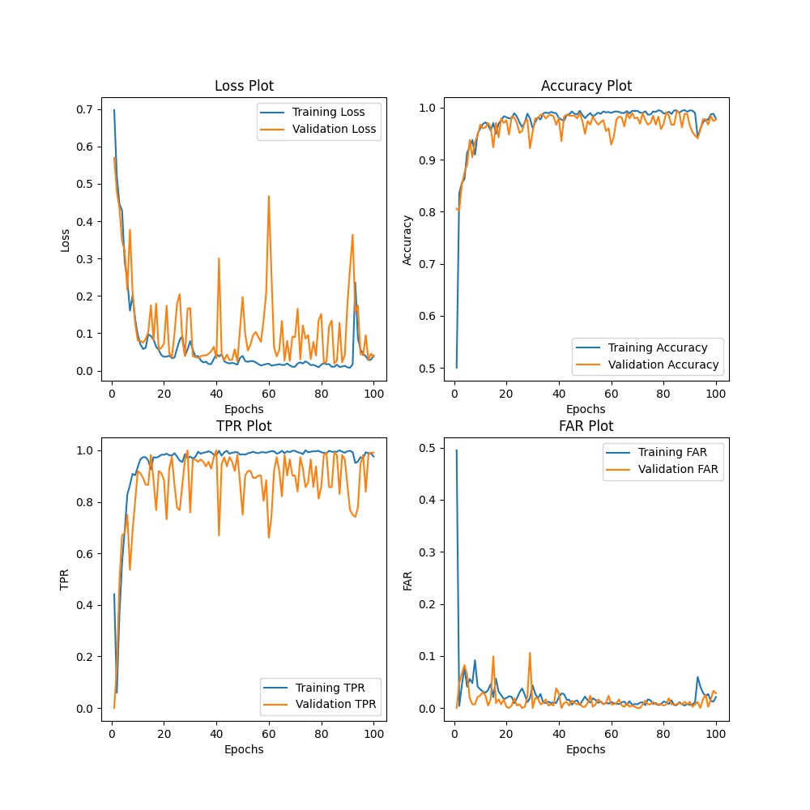
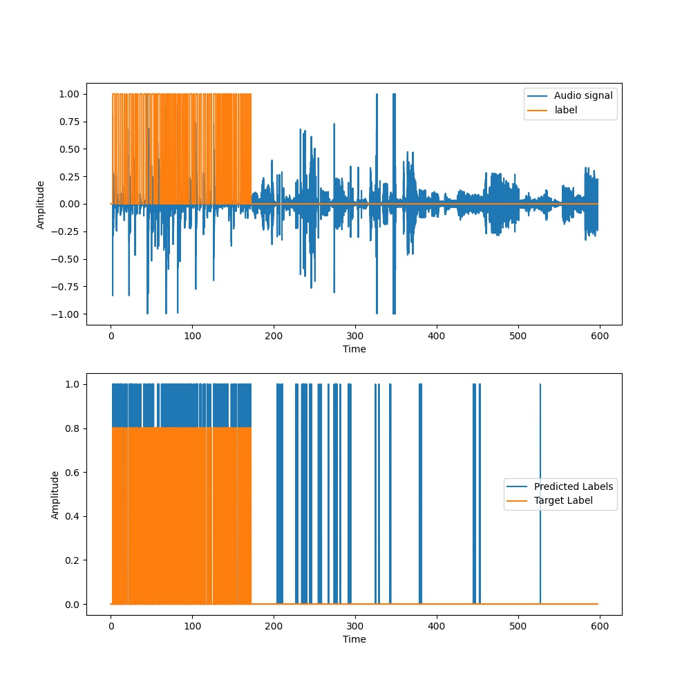
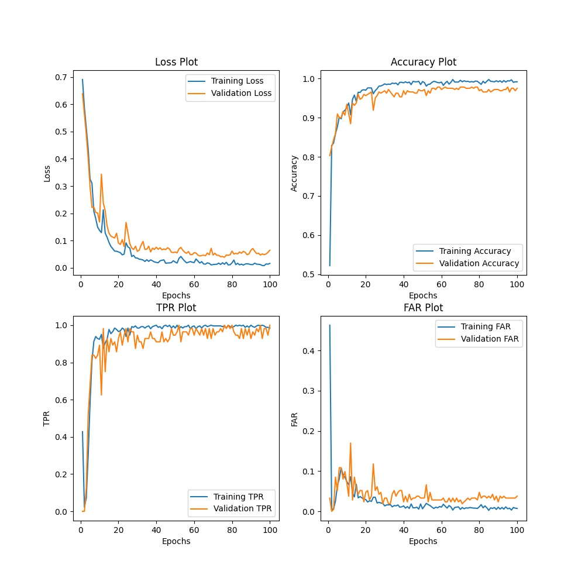
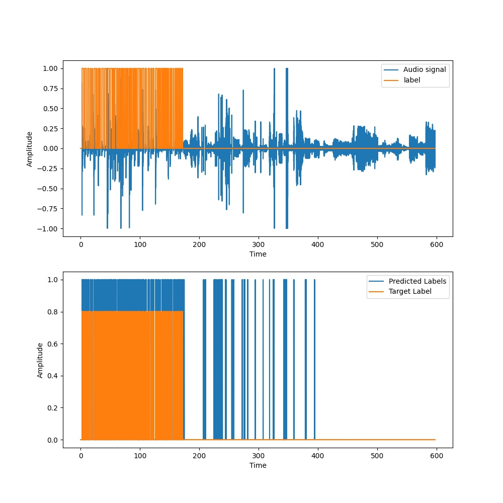
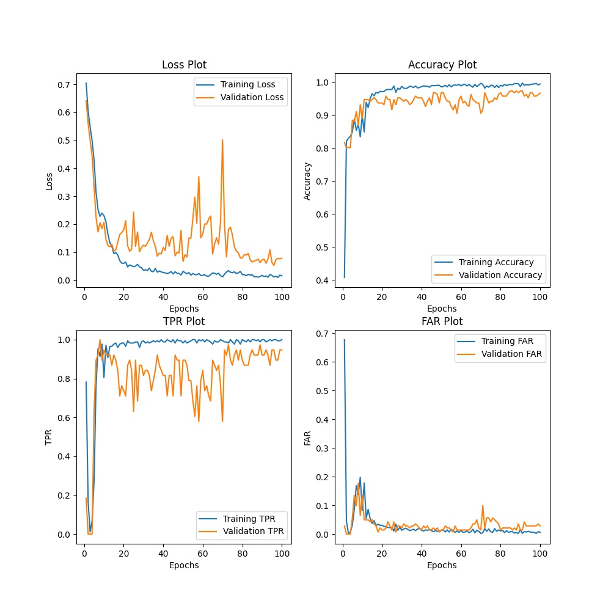
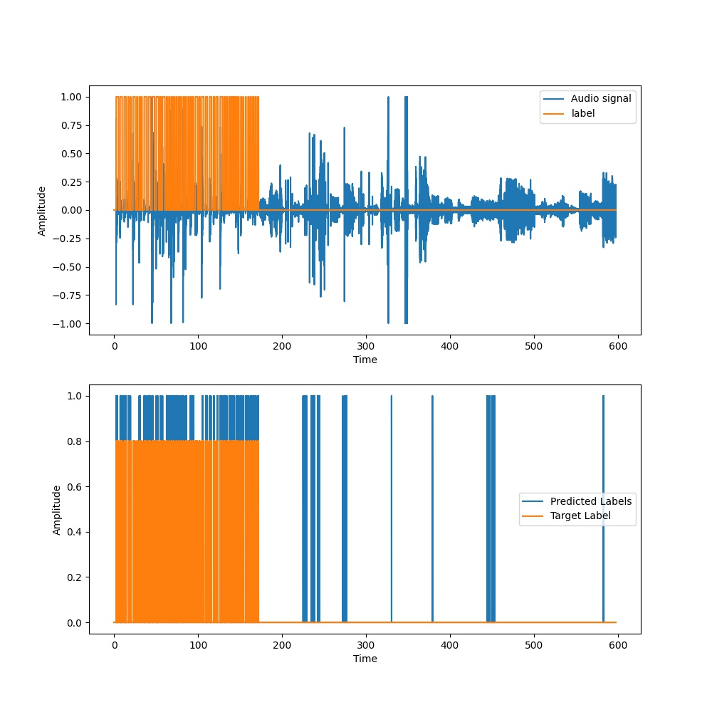
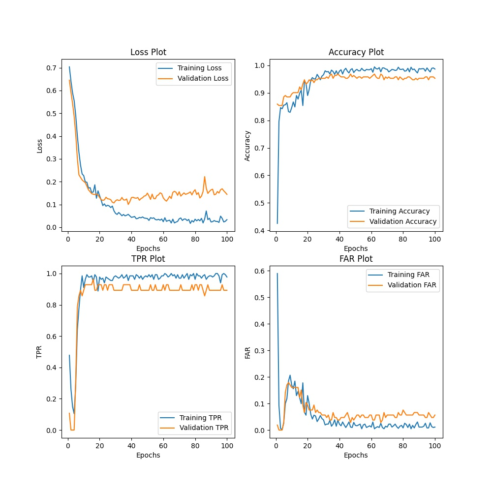
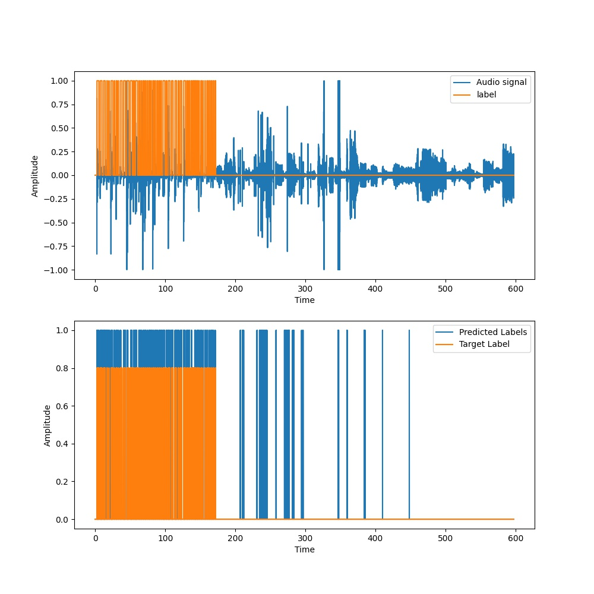

Metrics | T = 50ms, N = 100 | T = 100ms, N = 100 | T = 150ms, N = 100 | T = 200ms N = 100
:------:|:-----------------:|:------------------:|:------------------:|:----------------:
Loss | 0.41528 | 0.24313 | 0.49924 | 0.30376
Accuracy | 0.94510 | 0.94664 | 0.93055 | 0.93384
TPR | 0.80242 | 0.84563 | 0.59274 | 0.75268
FAR | 0.03478 | 0.03939 | 0.02236 | 0.04093

<table>
  <tr>
    <td>T = 50ms, N = 100</td>
     <td>T = 50ms, N = 100</td>
  </tr>
  <tr>
    <td></td>
    <td></td>
  </tr>
 </table>
 
 <table>
  <tr>
    <td>T = 100ms, N = 100</td>
     <td>T = 100ms, N = 100</td>
  </tr>
  <tr>
    <td></td>
    <td></td>
  </tr>
 </table>
 
 <table>
  <tr>
    <td>T = 150ms, N = 100</td>
     <td>T = 150ms, N = 100</td>
  </tr>
  <tr>
    <td></td>
    <td></td>
  </tr>
 </table>
 
 <table>
  <tr>
    <td>T = 200ms, N = 100</td>
     <td>T = 200ms, N = 100</td>
  </tr>
  <tr>
    <td></td>
    <td></td>
  </tr>
 </table>
