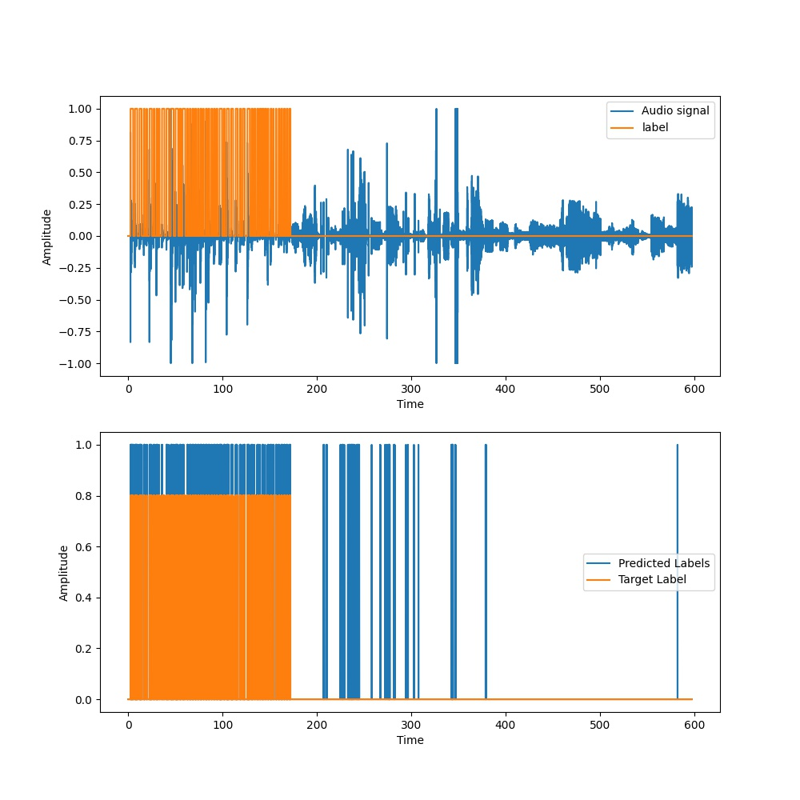

Metrics | T = 50ms, N = 100 | T = 100ms, N = 200 | T = 150ms, N = 250 | T = 200ms N = 350
:------:|:-----------------:|:------------------:|:------------------:|:----------------:
Loss | 0.44012 | 0.48412 | 0.38836 | 0.34122
Accuracy | 0.92960 | 0.94510 | 0.93637 | 0.94198
TPR | 0.82816 | 0.64126 | 0.80081 | 0.75034
FAR | 0.05614 | 0.01194 | 0.04472 | 0.03117

<table>
  <tr>
    <td>T = 50ms, N = 100</td>
     <td>T = 50ms, N = 100</td>
  </tr>
  <tr>
    <td></td>
    <td></td>
  </tr>
 </table>
 
 <table>
  <tr>
    <td>T = 100ms, N = 200</td>
     <td>T = 100ms, N = 200</td>
  </tr>
  <tr>
    <td></td>
    <td></td>
  </tr>
 </table>
 
 <table>
  <tr>
    <td>T = 150ms, N = 250</td>
     <td>T = 150ms, N = 250</td>
  </tr>
  <tr>
    <td></td>
    <td></td>
  </tr>
 </table>
 
 <table>
  <tr>
    <td>T = 200ms, N = 350</td>
     <td>T = 200ms, N = 350</td>
  </tr>
  <tr>
    <td></td>
    <td></td>
  </tr>
 </table>
