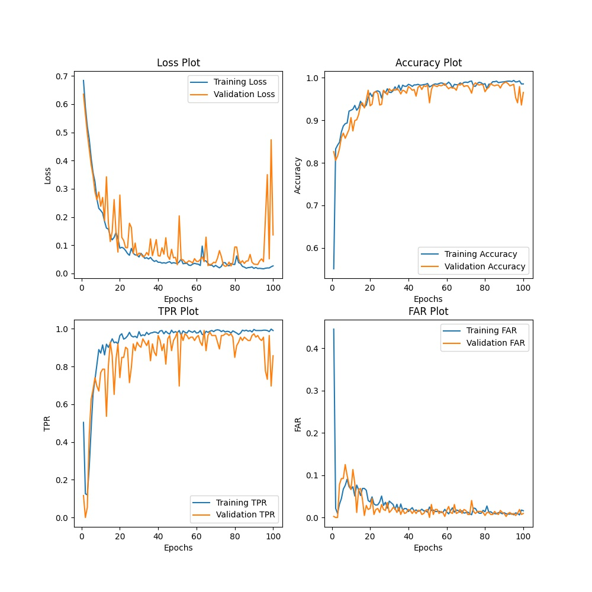
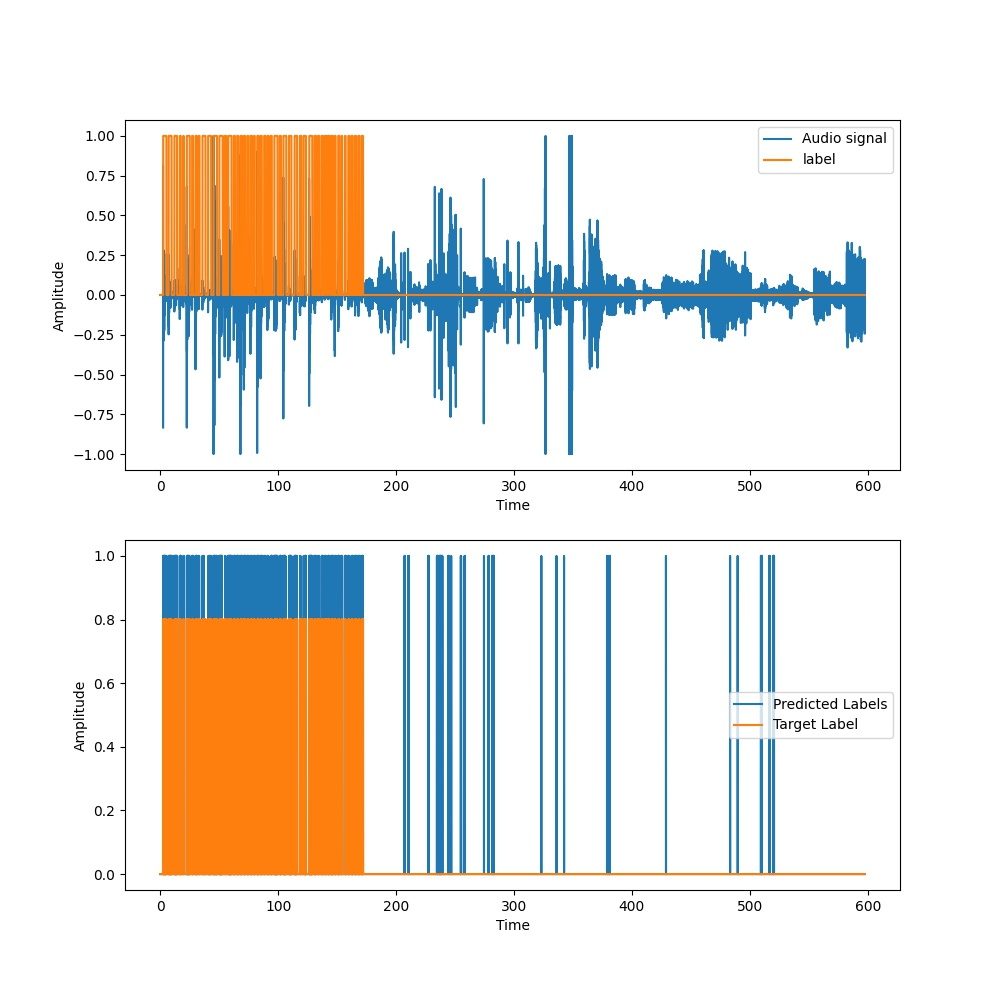
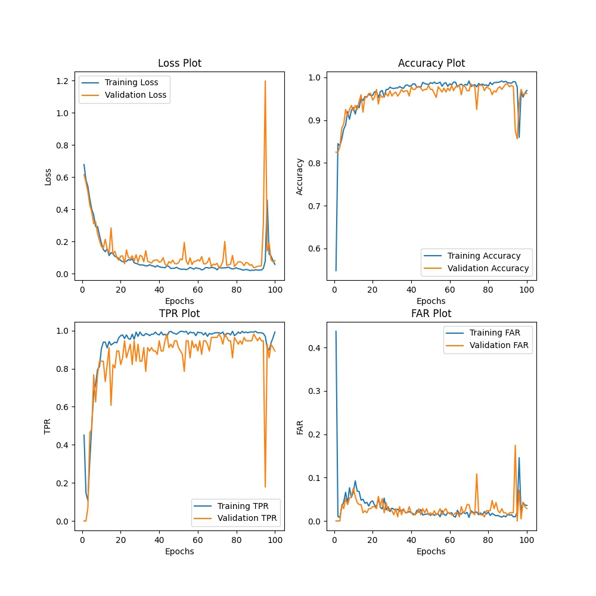
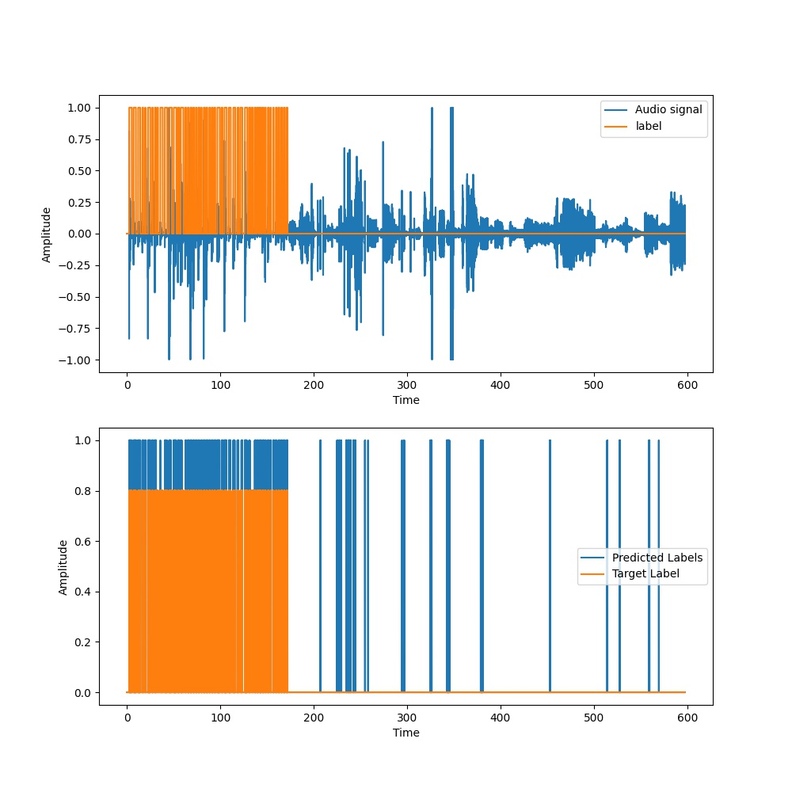
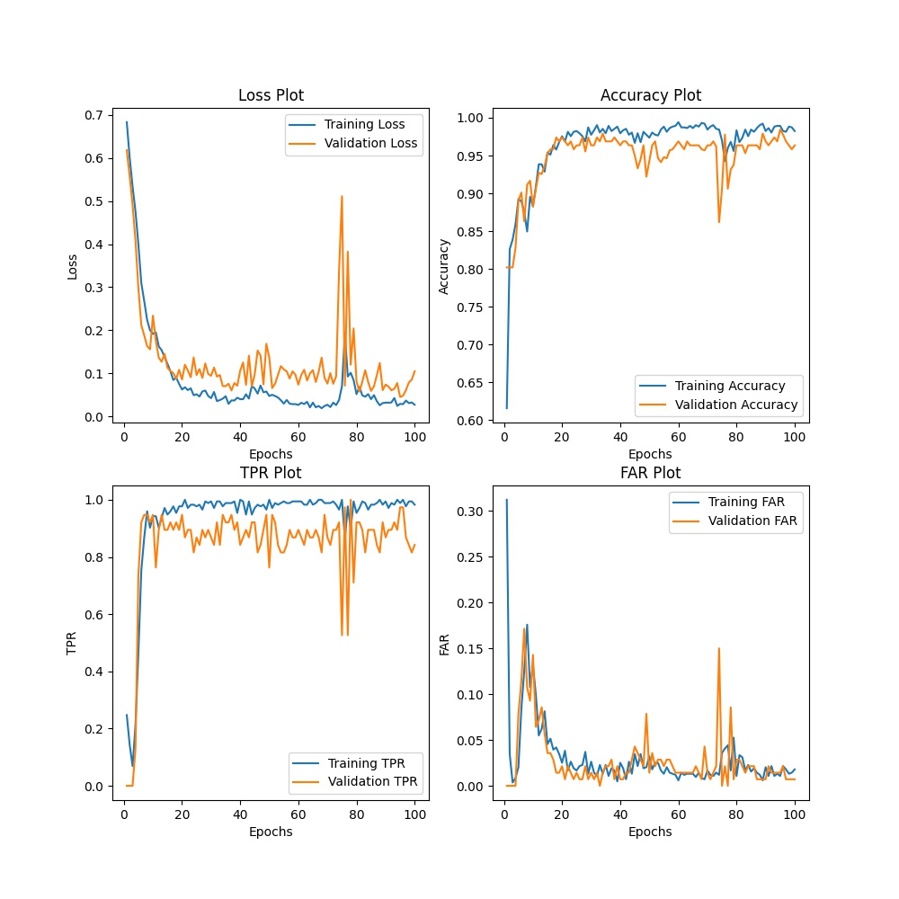
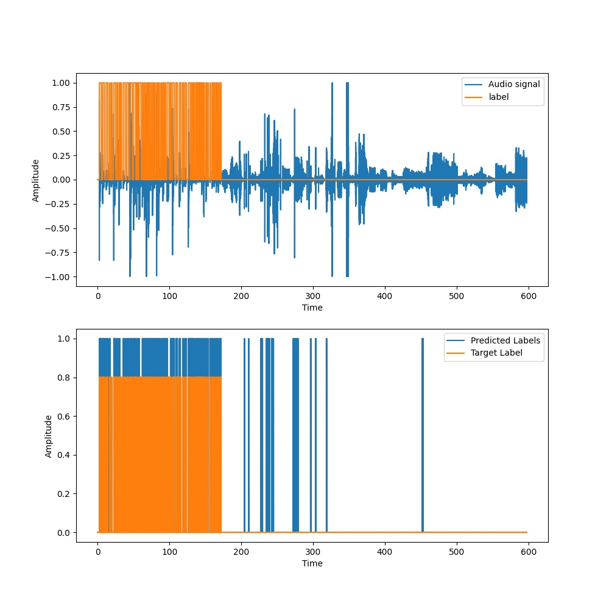
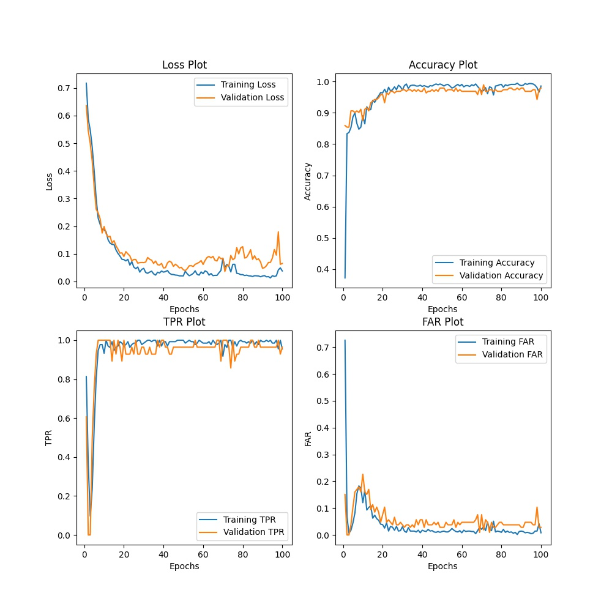
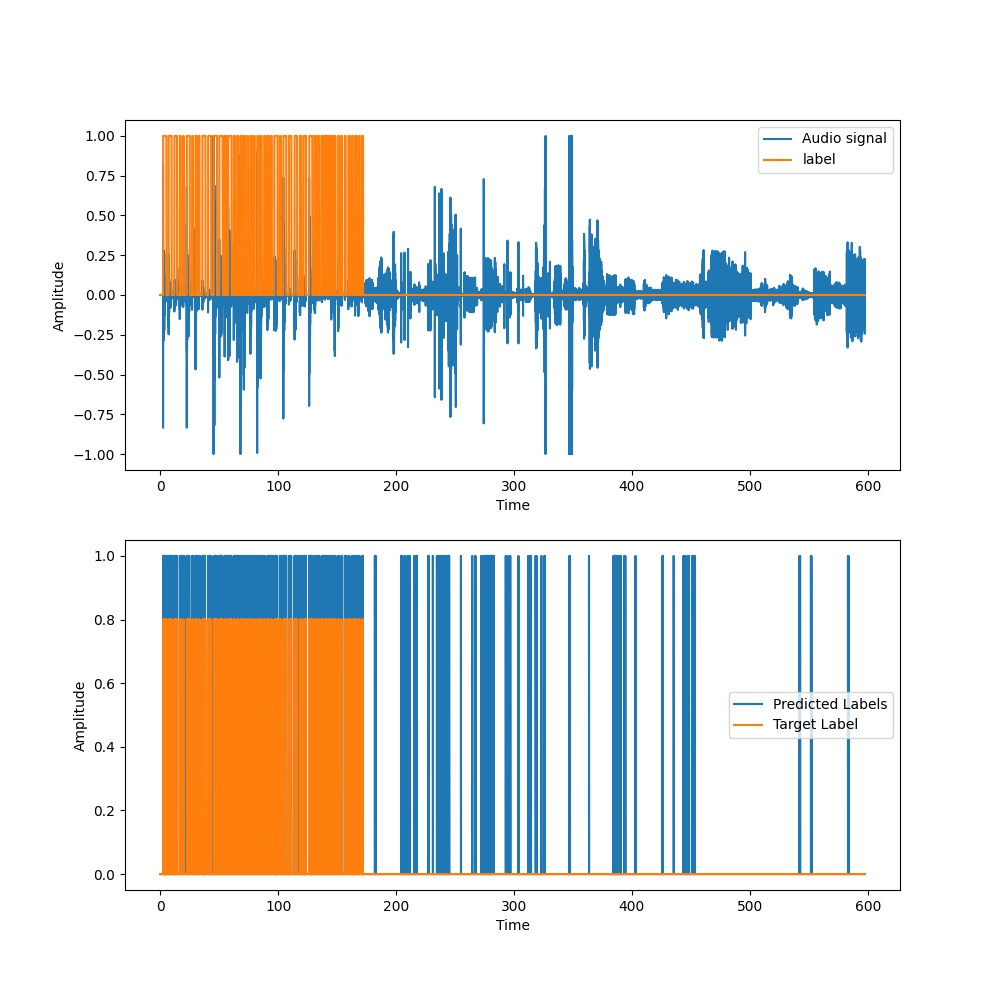

Metrics | T = 50ms, N = 100 | T = 100ms, N = 200 | T = 150ms, N = 250 | T = 200ms N = 350
:------:|:-----------------:|:------------------:|:------------------:|:----------------:
Loss | 0.34401 | 0.33793 | 0.22571 | 0.35138
Accuracy | 0.95137 | 0.93883 | 0.95138 | 0.92221
TPR | 0.76534 | 0.76107 | 0.82258 | 0.92742
FAR | 0.02236 | 0.03633 | 0.03098 | 0.07918
Event based TPR | 1.0 | 0.96 | 0.96 | 1.0 
Average Latency(s) | 0.07869 | 0.10327 | 0.11356 | 0.10869

<table>
  <tr>
    <td>T = 50ms, N = 100</td>
     <td>T = 50ms, N = 100</td>
  </tr>
  <tr>
    <td></td>
    <td></td>
  </tr>
 </table>
 
 <table>
  <tr>
    <td>T = 100ms, N = 200</td>
     <td>T = 100ms, N = 200</td>
  </tr>
  <tr>
    <td></td>
    <td></td>
  </tr>
 </table>
 
 <table>
  <tr>
    <td>T = 150ms, N = 250</td>
     <td>T = 150ms, N = 250</td>
  </tr>
  <tr>
    <td></td>
    <td></td>
  </tr>
 </table>
 
 <table>
  <tr>
    <td>T = 200ms, N = 350</td>
     <td>T = 200ms, N = 350</td>
  </tr>
  <tr>
    <td></td>
    <td></td>
  </tr>
 </table>
