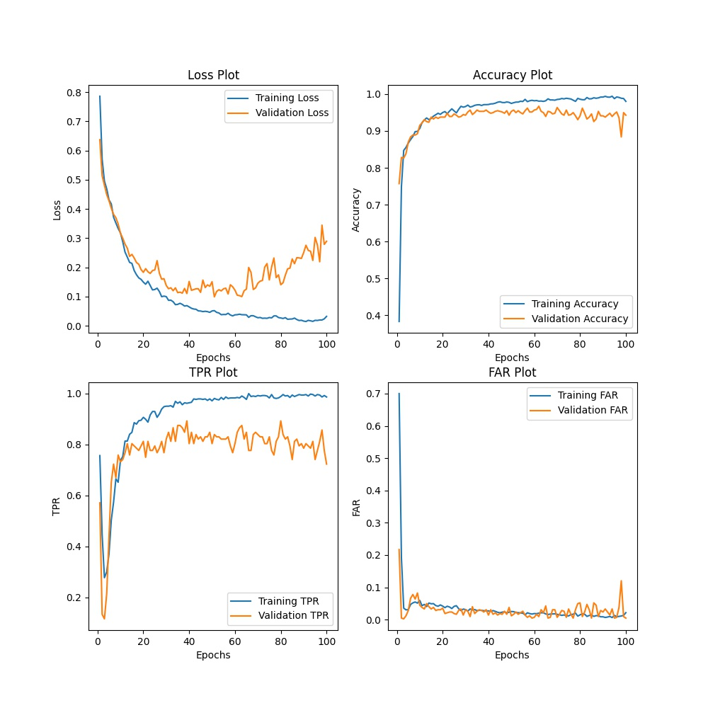
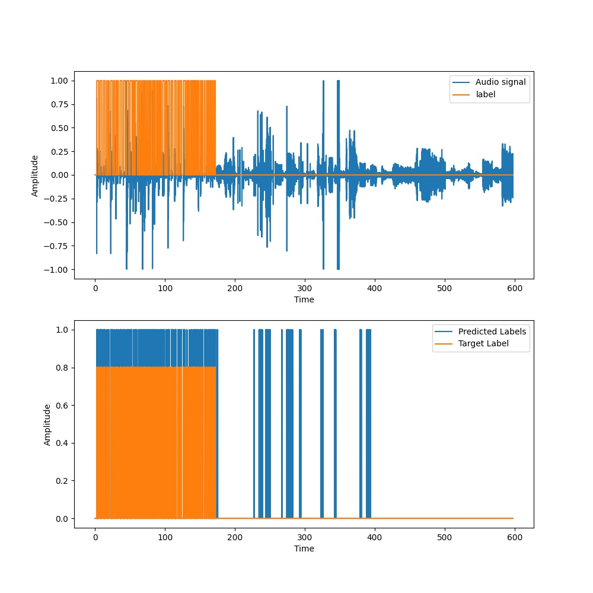
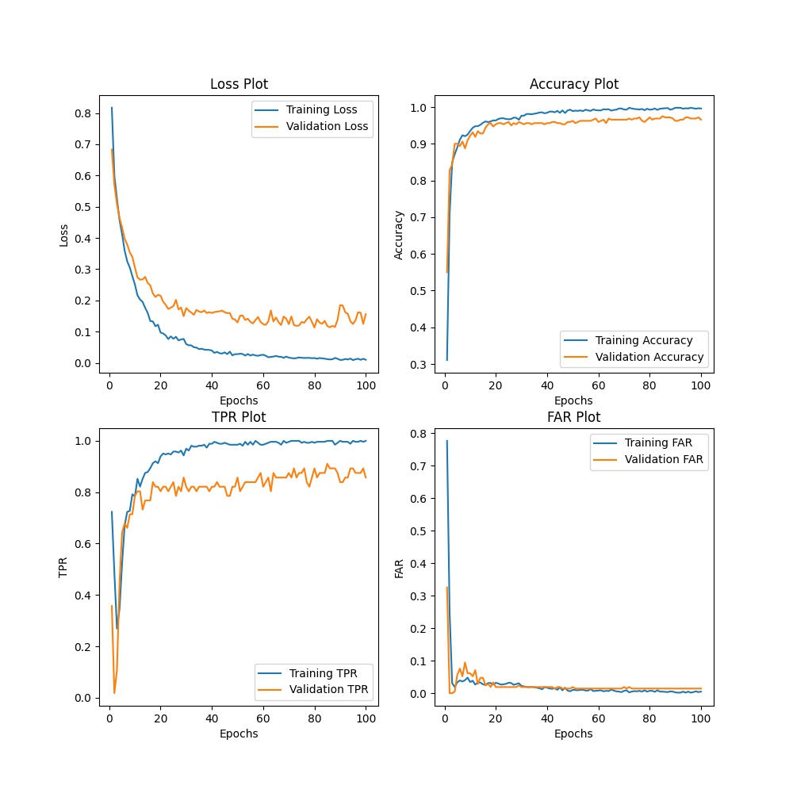
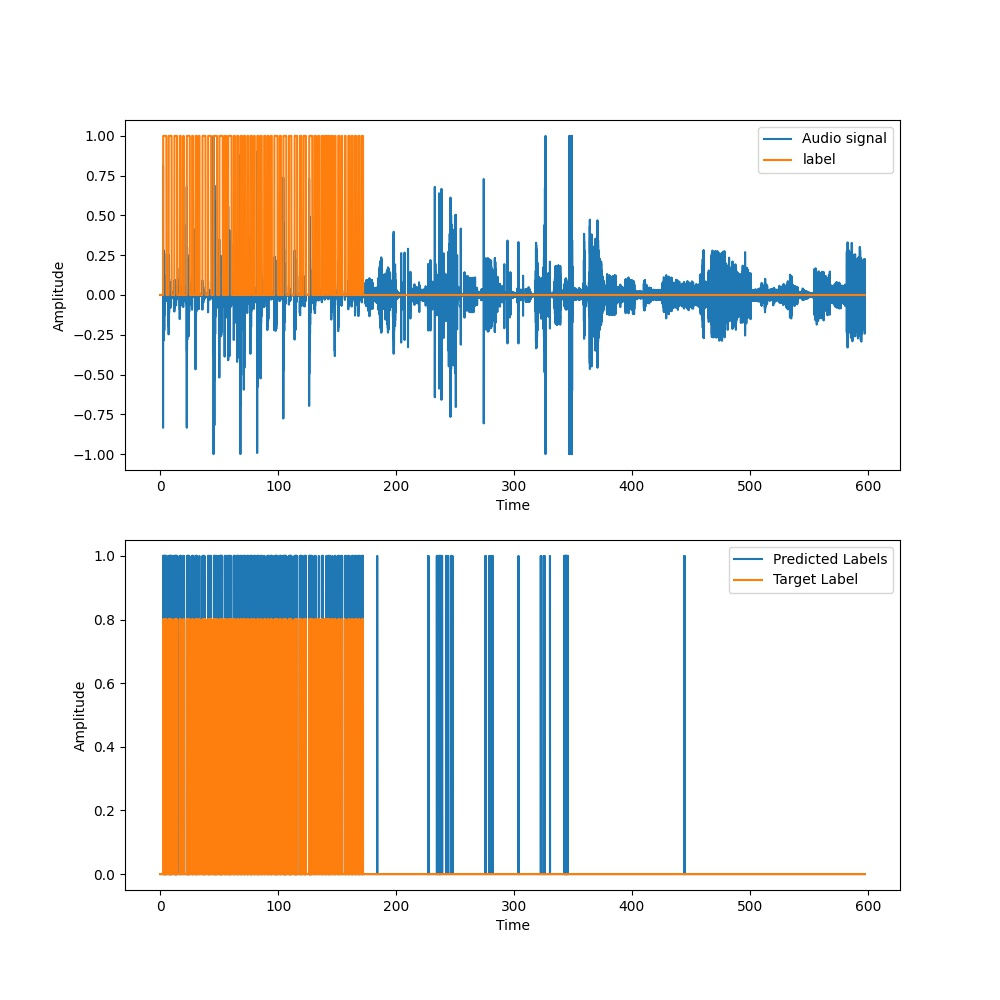
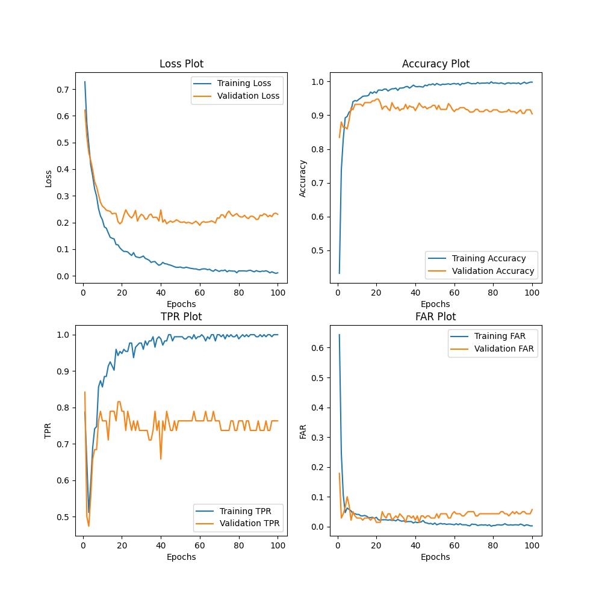
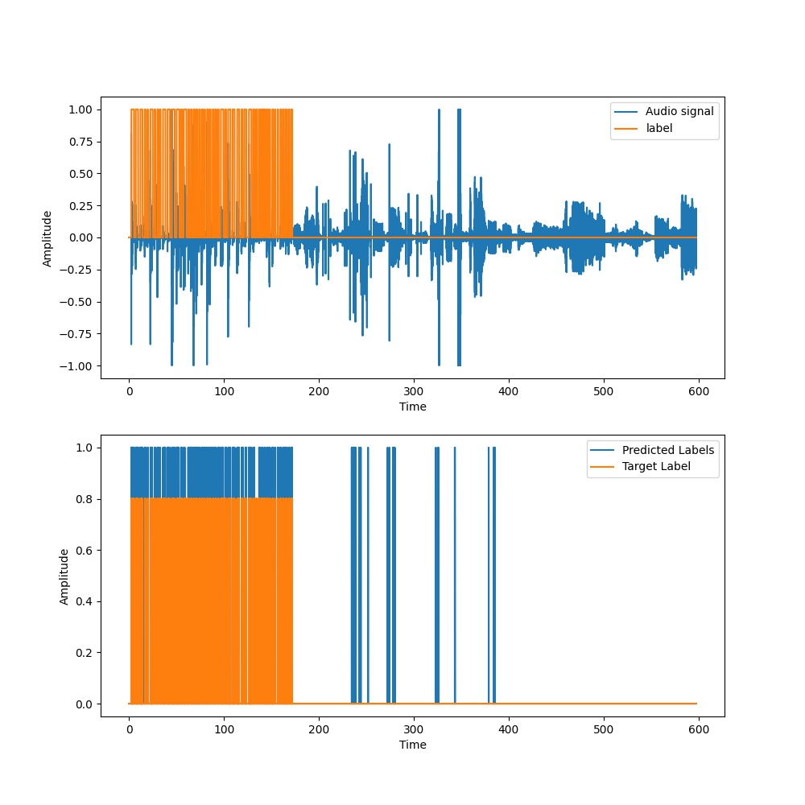
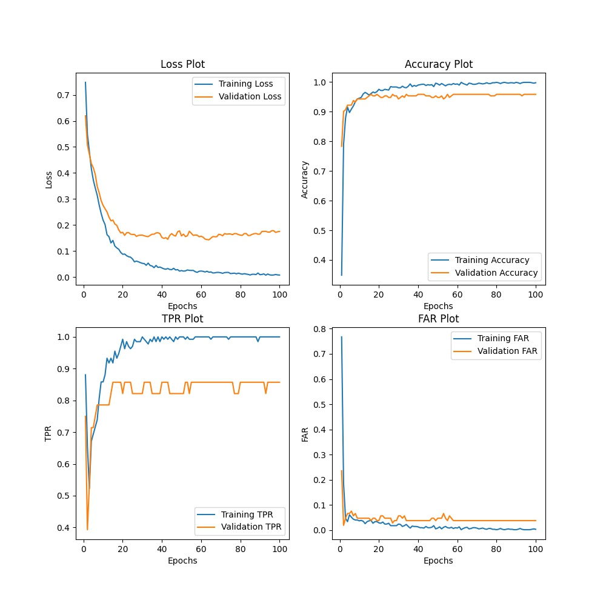
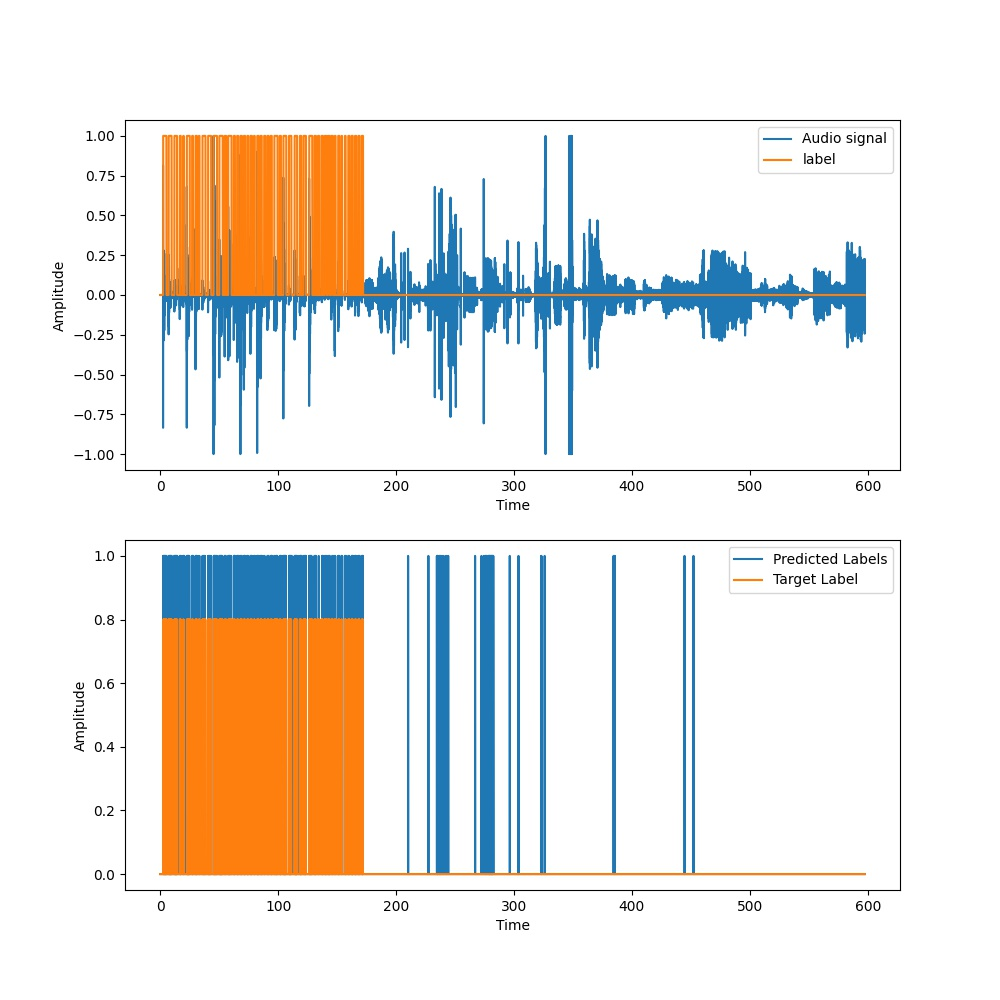

Metrics | T = 50ms, N = 100 | T = 100ms, N = 200 | T = 150ms, N = 250 | T = 200ms N = 350
:------:|:-----------------:|:------------------:|:------------------:|:----------------:
Loss | 0.26099 | 0.20764 | 0.20635 | 0.17532
Accuracy | 0.94176 | 0.95113 | 0.95014 | 0.95046
TPR | 0.72353 | 0.73959 | 0.70564 | 0.81720
FAR | 0.02742 | 0.01912 | 0.01577 | 0.03098
Event based TPR | 0.98 | 1.0 | 0.98 | 1.0 
Average Latency(s) | 0.10571 | 0.16269 | 0.16999 | 0.13269

<table>
  <tr>
    <td>T = 50ms, N = 100</td>
     <td>T = 50ms, N = 100</td>
  </tr>
  <tr>
    <td></td>
    <td></td>
  </tr>
 </table>
 
 <table>
  <tr>
    <td>T = 100ms, N = 200</td>
     <td>T = 100ms, N = 200</td>
  </tr>
  <tr>
    <td></td>
    <td></td>
  </tr>
 </table>
 
 <table>
  <tr>
    <td>T = 150ms, N = 250</td>
     <td>T = 150ms, N = 250</td>
  </tr>
  <tr>
    <td></td>
    <td></td>
  </tr>
 </table>
 
 <table>
  <tr>
    <td>T = 200ms, N = 350</td>
     <td>T = 200ms, N = 350</td>
  </tr>
  <tr>
    <td></td>
    <td></td>
  </tr>
 </table>
