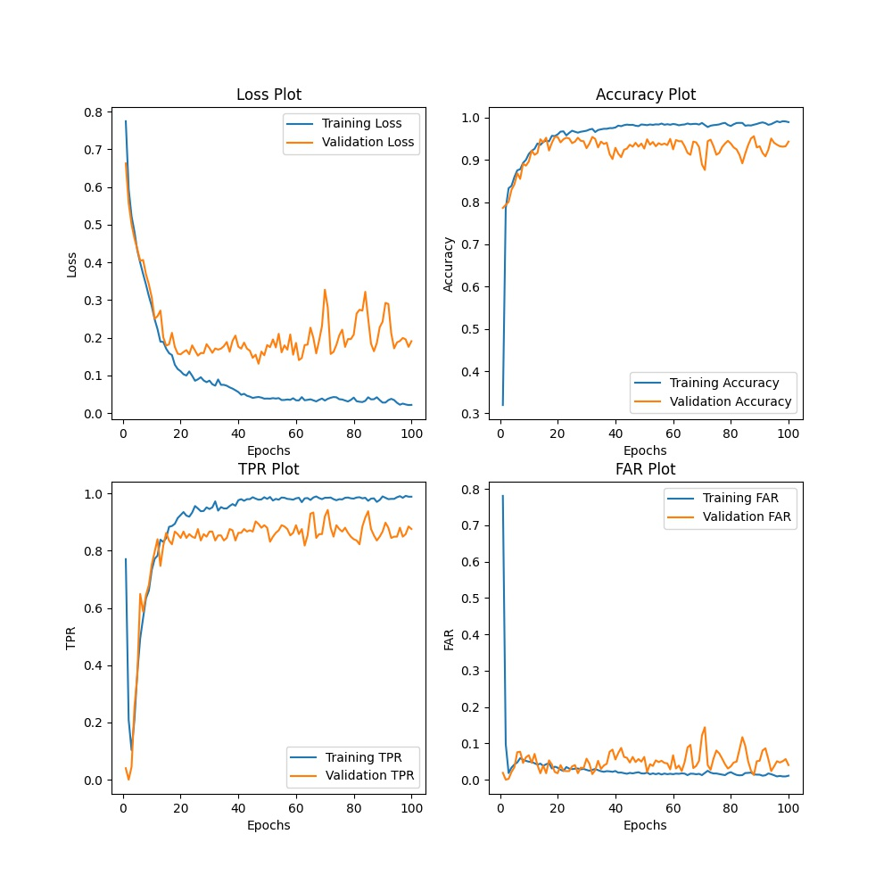
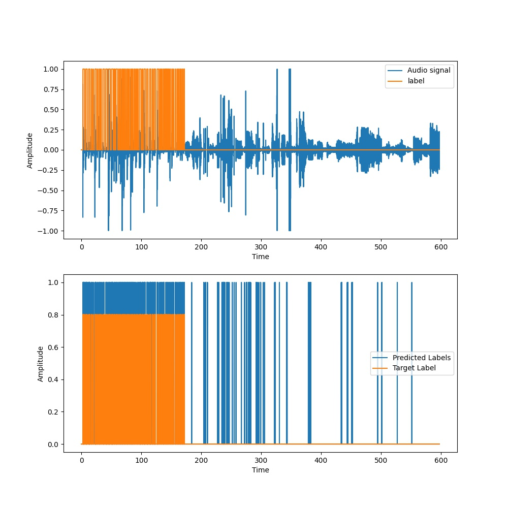
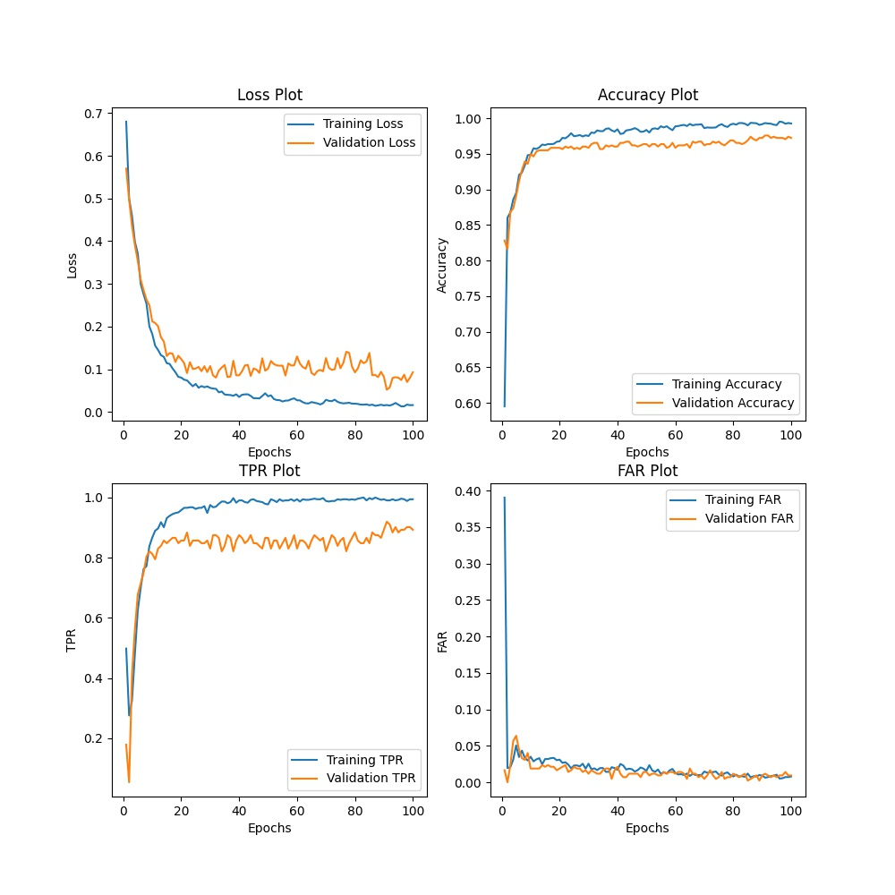
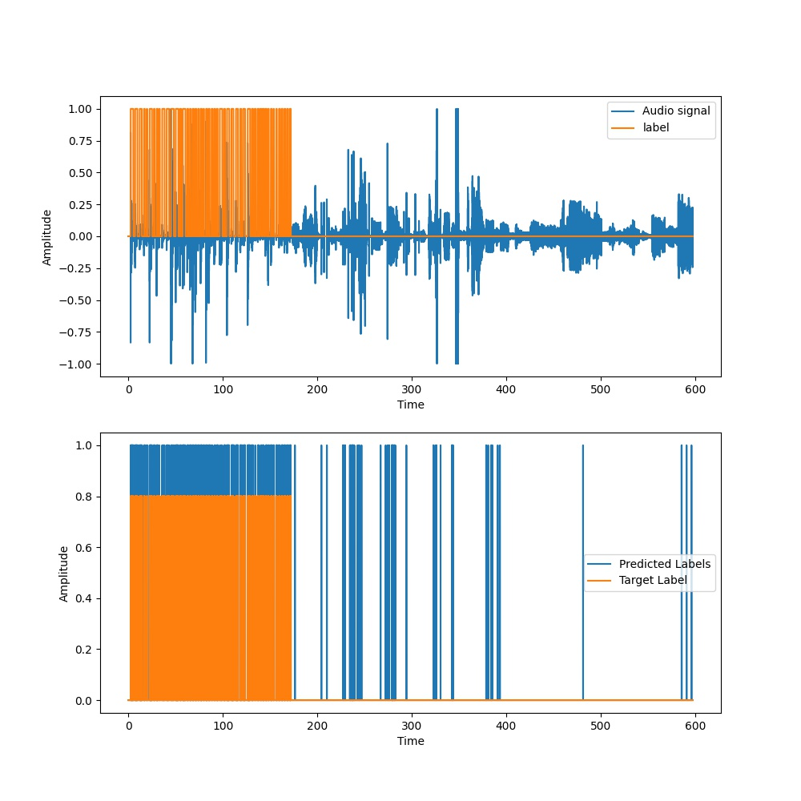
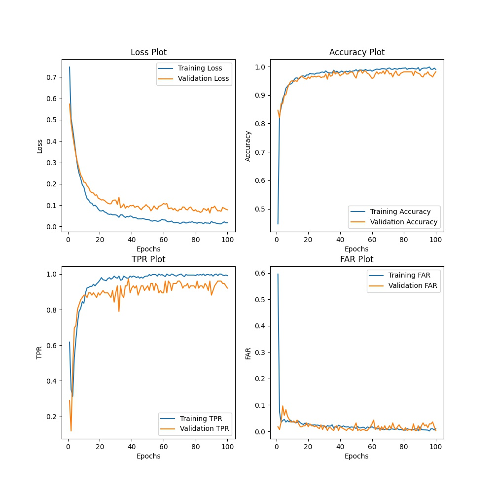
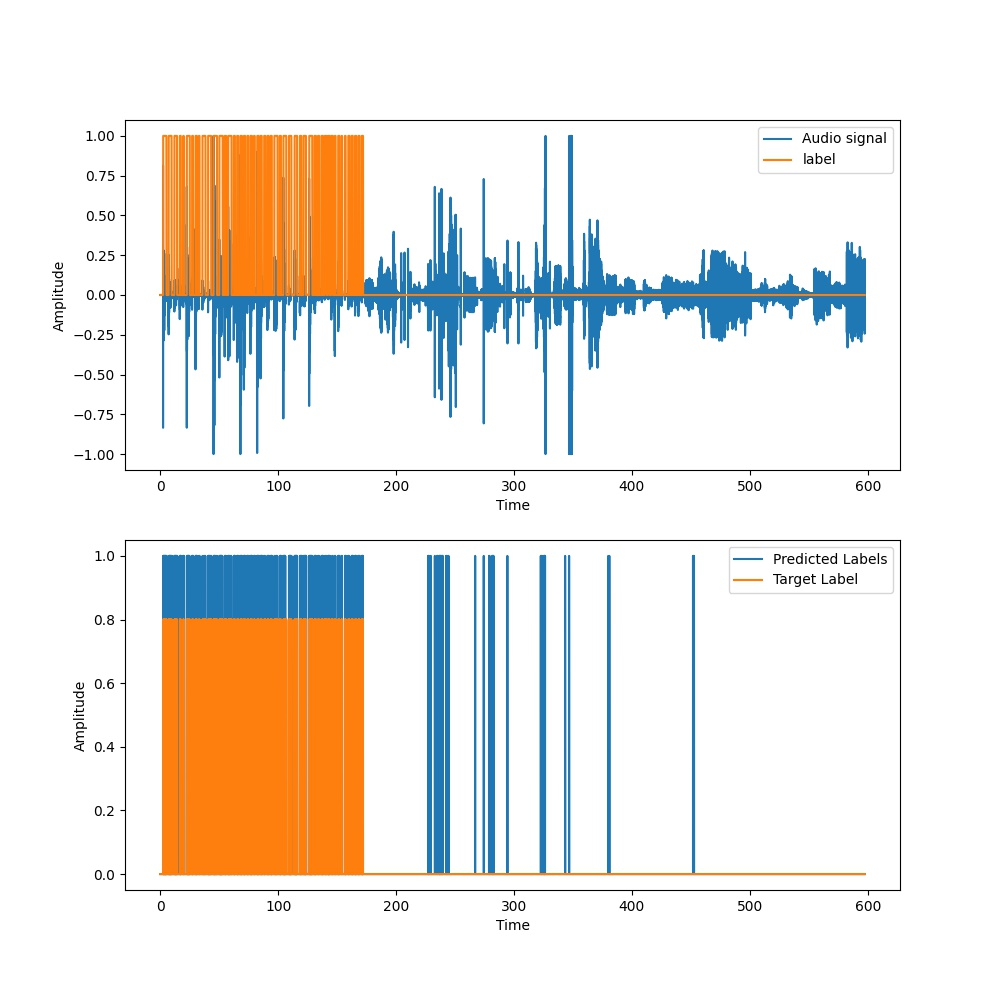
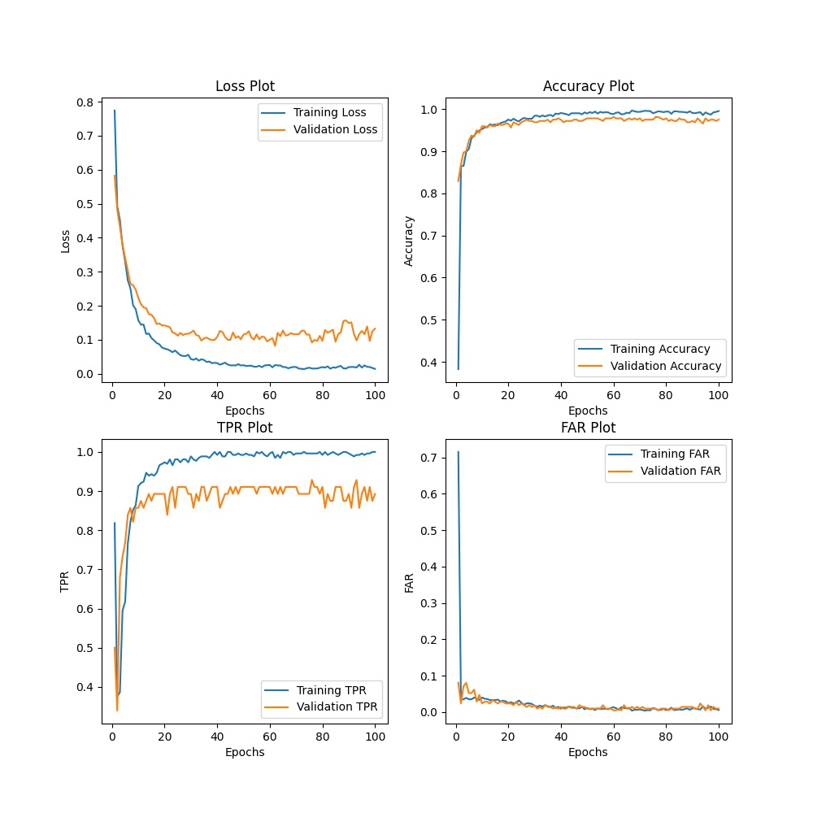
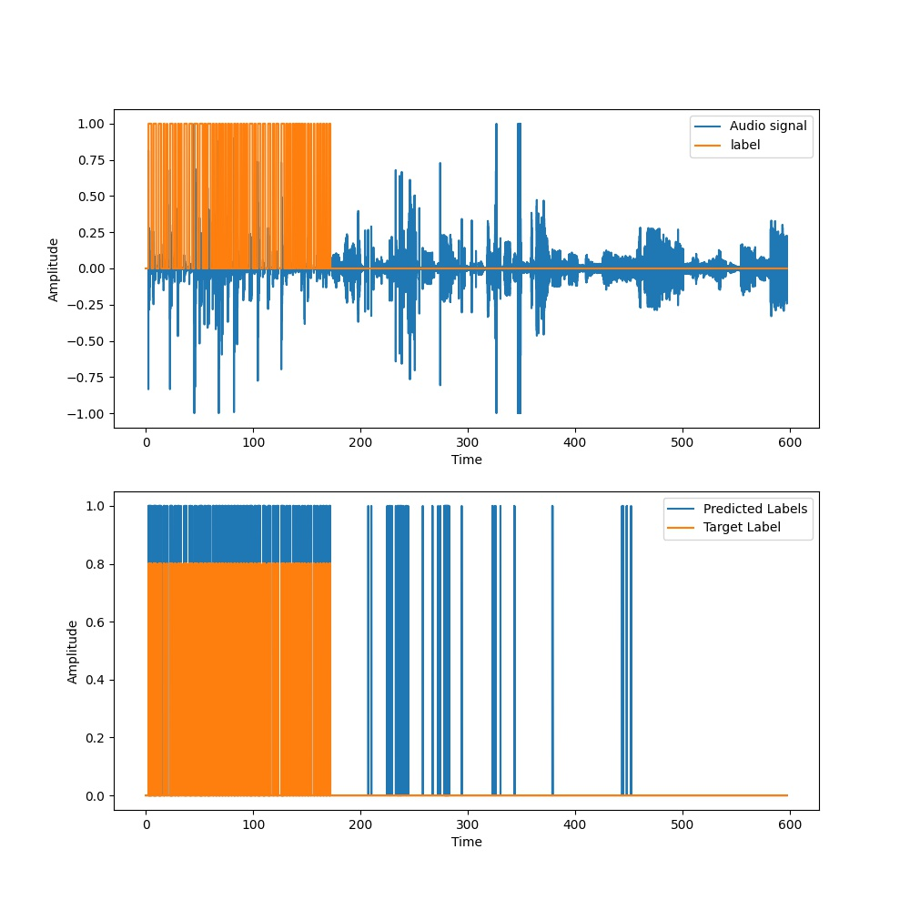

Metrics | T = 50ms, N = 100 | T = 100ms, N = 200 | T = 150ms, N = 250 | T = 200ms N = 350
:------:|:-----------------:|:------------------:|:------------------:|:----------------:
Loss | 0.26111 | 0.21978 | 0.20544 | 0.20340
Accuracy | 0.94364 | 0.95049 | 0.953 | 0.94647
TPR | 0.70721 | 0.74983 | 0.75733 | 0.75033
FAR | 0.02293 | 0.02112 | 0.01949 | 0.02601
Event based TPR | 1.0 | 1.0 | 1.0 | 1.0
Average Latency(s) | 0.07669 | 0.09169 | 0.06519 | 0.07869

<table>
  <tr>
    <td>T = 50ms, N = 100</td>
     <td>T = 50ms, N = 100</td>
  </tr>
  <tr>
    <td></td>
    <td></td>
  </tr>
 </table>
 
 <table>
  <tr>
    <td>T = 100ms, N = 200</td>
     <td>T = 100ms, N = 200</td>
  </tr>
  <tr>
    <td></td>
    <td></td>
  </tr>
 </table>
 
 <table>
  <tr>
    <td>T = 150ms, N = 250</td>
     <td>T = 150ms, N = 250</td>
  </tr>
  <tr>
    <td></td>
    <td></td>
  </tr>
 </table>
 
 <table>
  <tr>
    <td>T = 200ms, N = 350</td>
     <td>T = 200ms, N = 350</td>
  </tr>
  <tr>
    <td></td>
    <td></td>
  </tr>
 </table>
