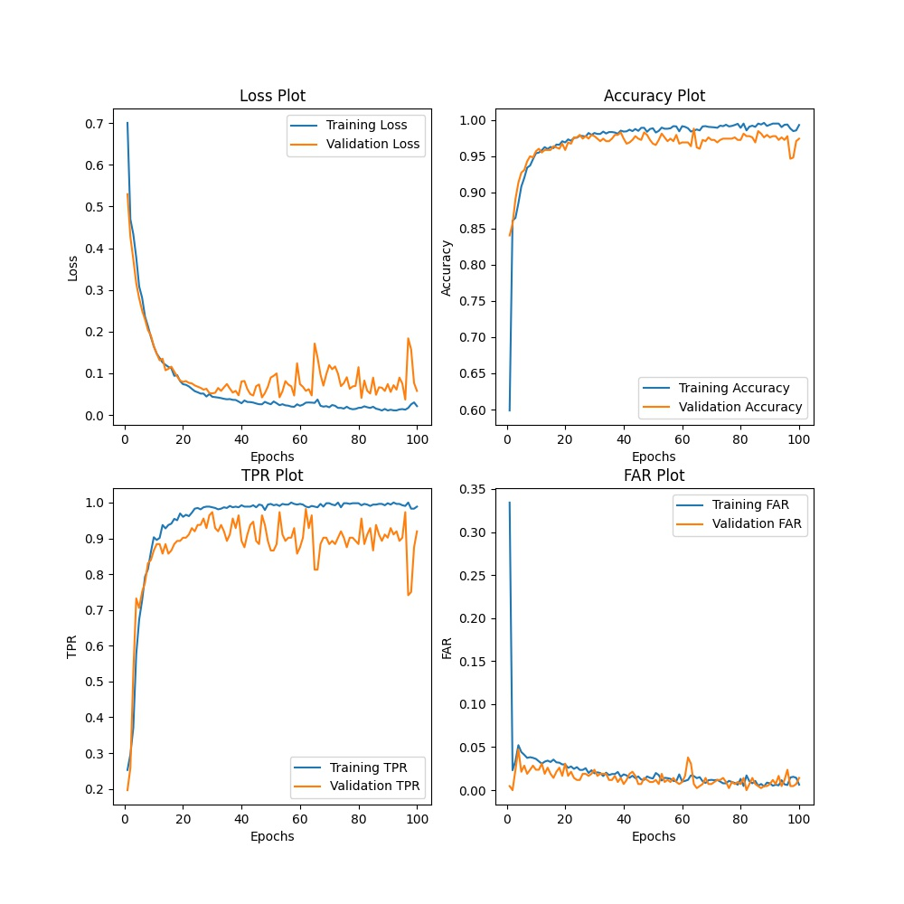
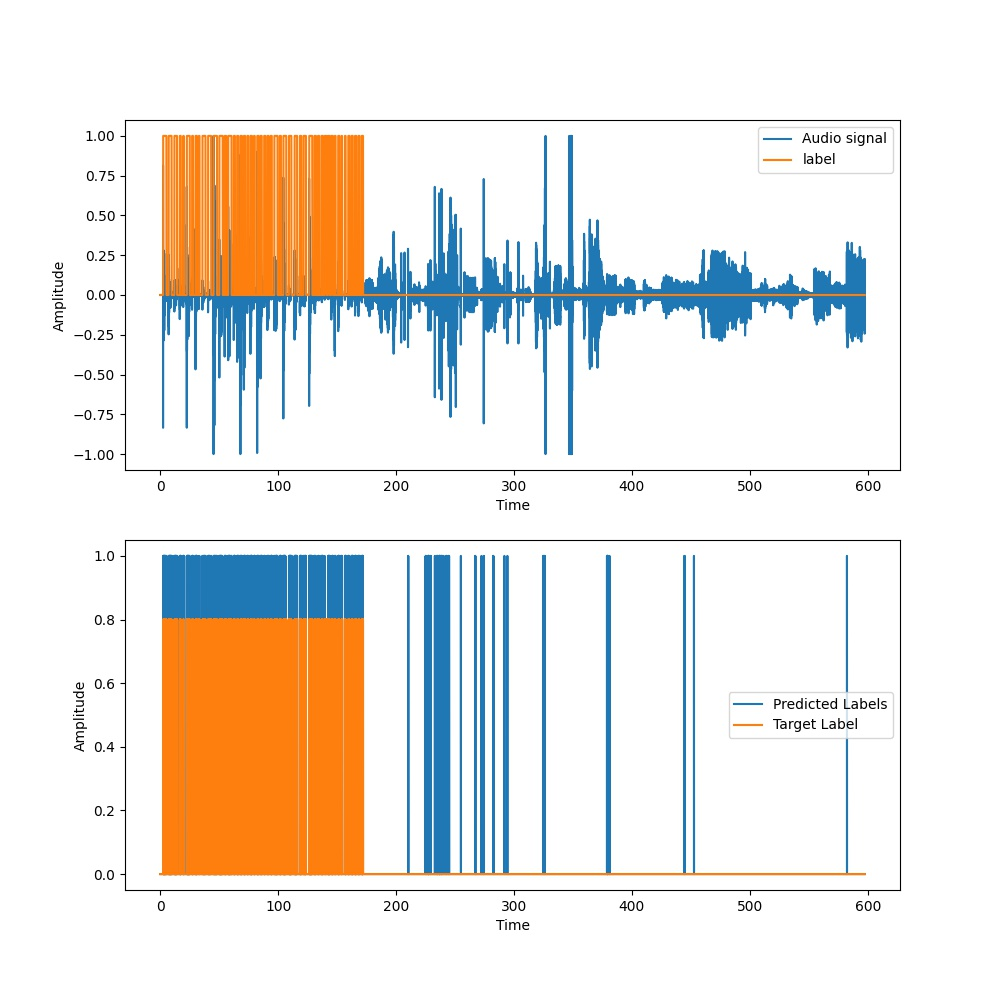
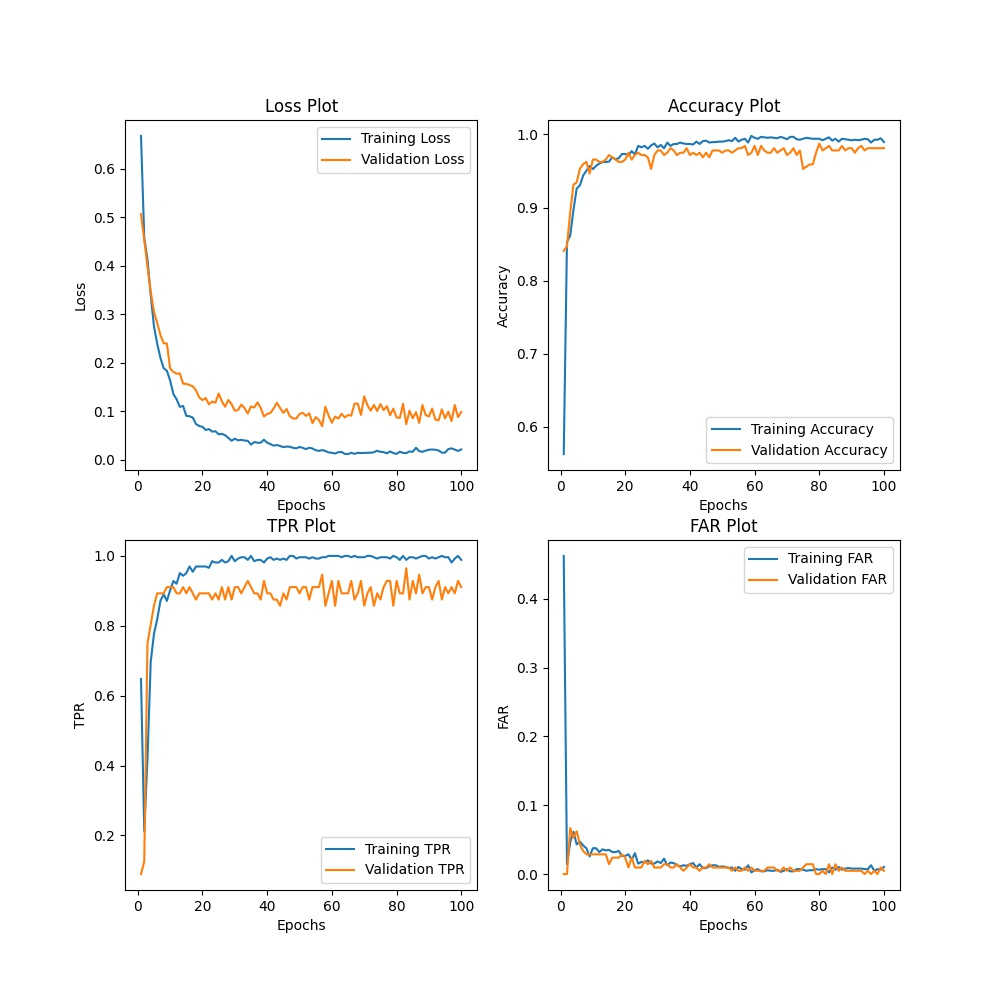
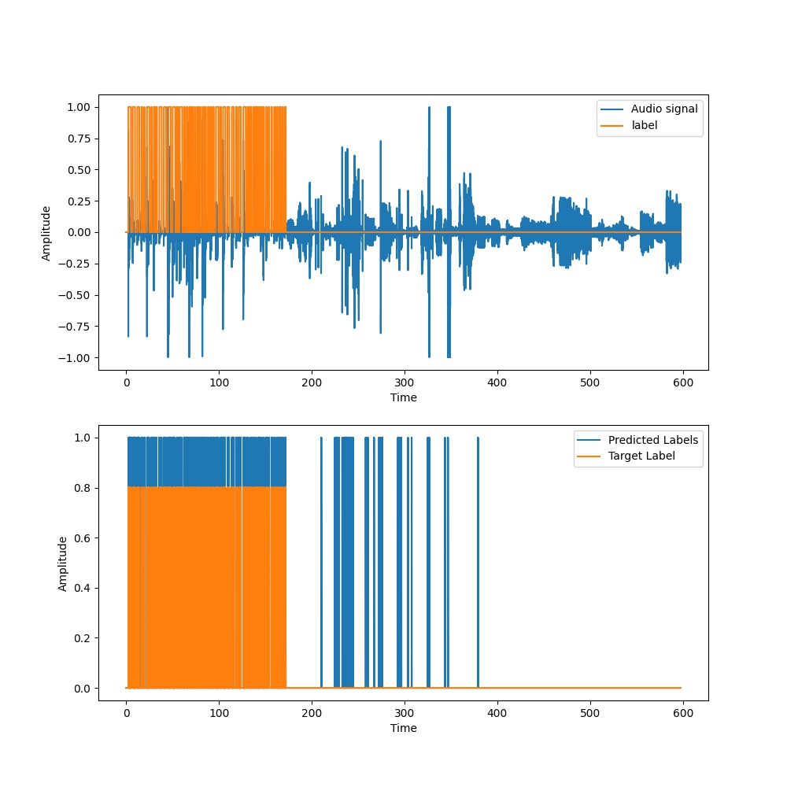
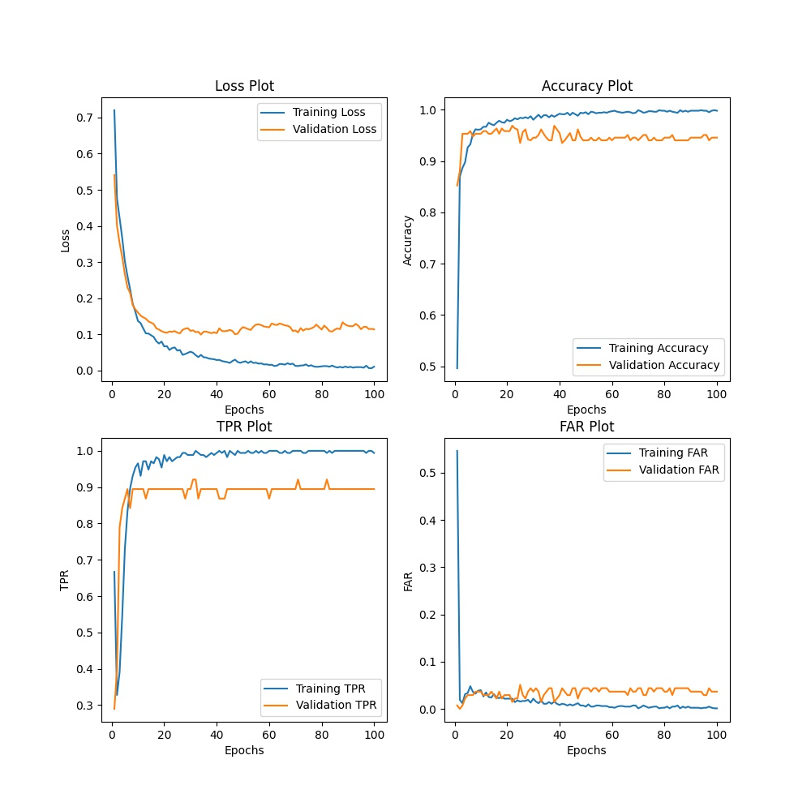
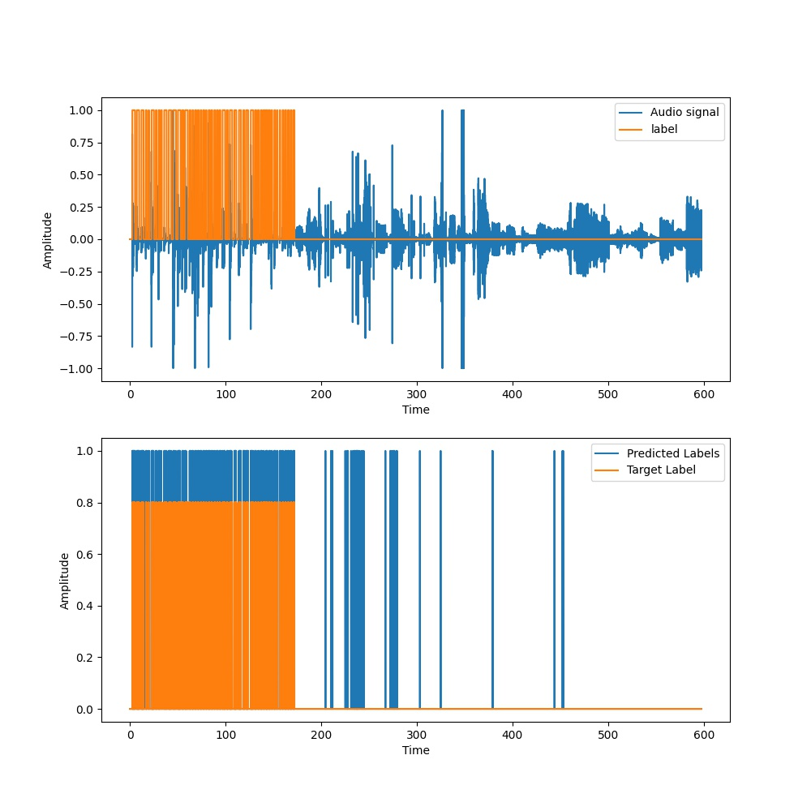
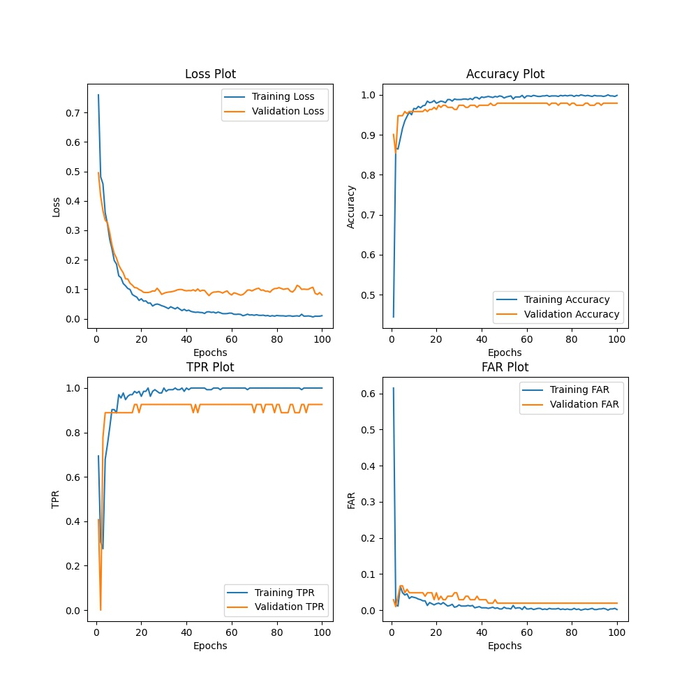
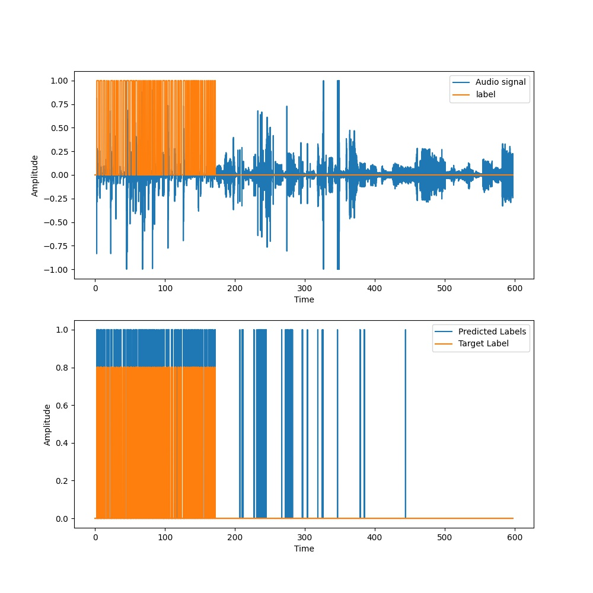

Metrics | T = 50ms, N = 100 | T = 100ms, N = 200 | T = 150ms, N = 250 | T = 200ms N = 350
:------:|:-----------------:|:------------------:|:------------------:|:----------------:
Loss | 0.19477 | 0.16253 | 0.15614 | 0.18320
Accuracy | 0.95454 | 0.95378 | 0.95610 | 0.94913
TPR | 0.75994 |0.76778 | 0.79637 | 0.81183
FAR | 0.01797 | 0.02009 | 0.02182 | 0.03178
Event based TPR | 1.0 | 1.0 | 1.0 | 1.0
Average Latency(s) | 0.05069 | 0.05669 | 0.11169 | 0.10869

<table>
  <tr>
    <td>T = 50ms, N = 100</td>
     <td>T = 50ms, N = 100</td>
  </tr>
  <tr>
    <td></td>
    <td></td>
  </tr>
 </table>
 
 <table>
  <tr>
    <td>T = 100ms, N = 200</td>
     <td>T = 100ms, N = 200</td>
  </tr>
  <tr>
    <td></td>
    <td></td>
  </tr>
 </table>
 
 <table>
  <tr>
    <td>T = 150ms, N = 250</td>
     <td>T = 150ms, N = 250</td>
  </tr>
  <tr>
    <td></td>
    <td></td>
  </tr>
 </table>
 
 <table>
  <tr>
    <td>T = 200ms, N = 350</td>
     <td>T = 200ms, N = 350</td>
  </tr>
  <tr>
    <td></td>
    <td></td>
  </tr>
 </table>
