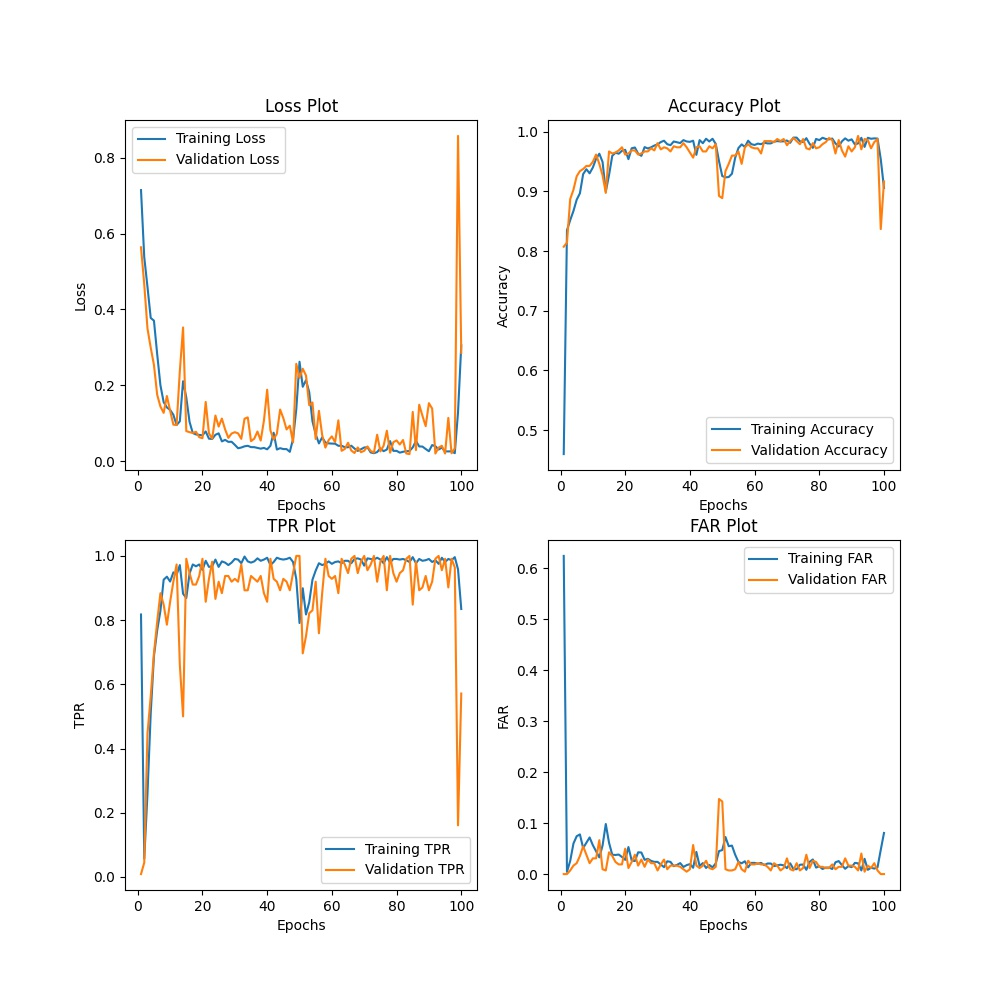
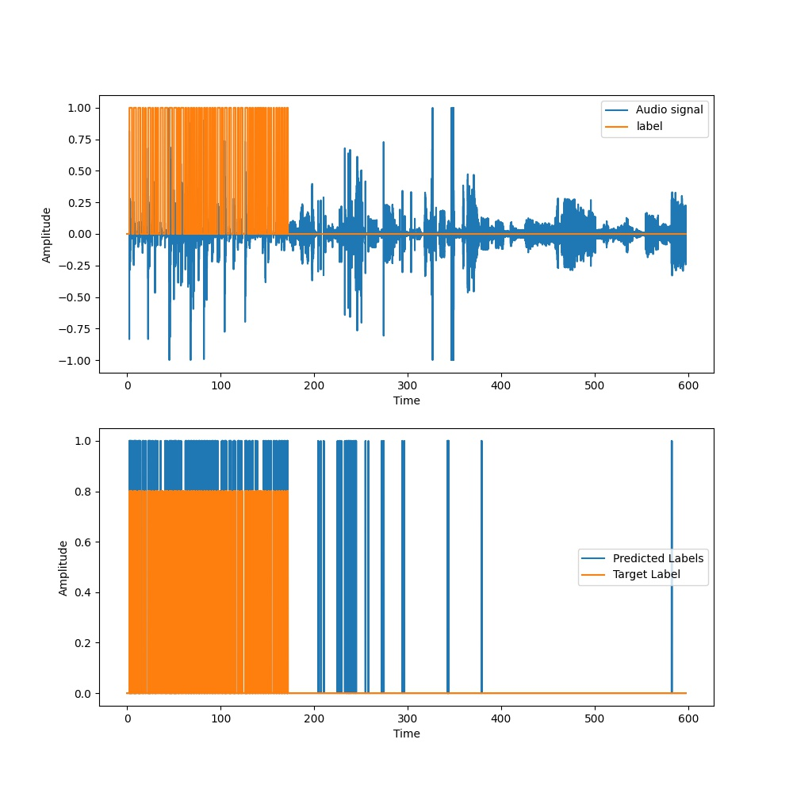
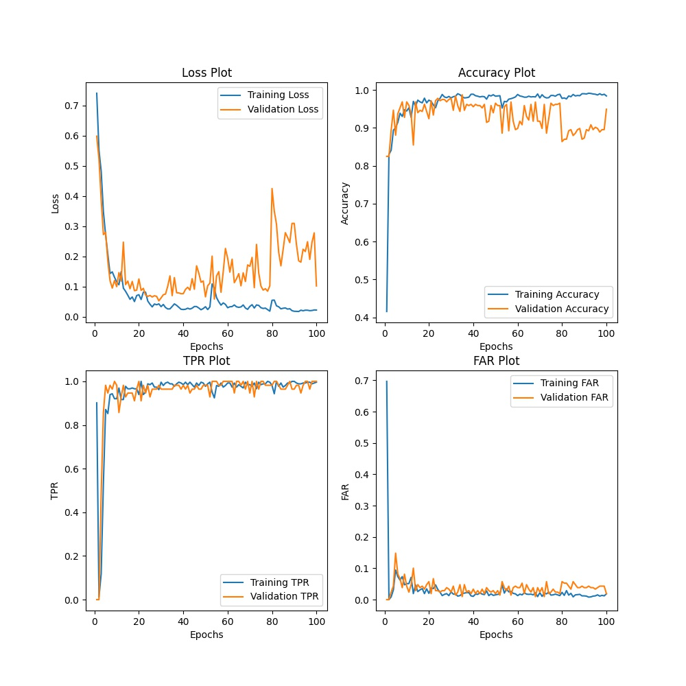
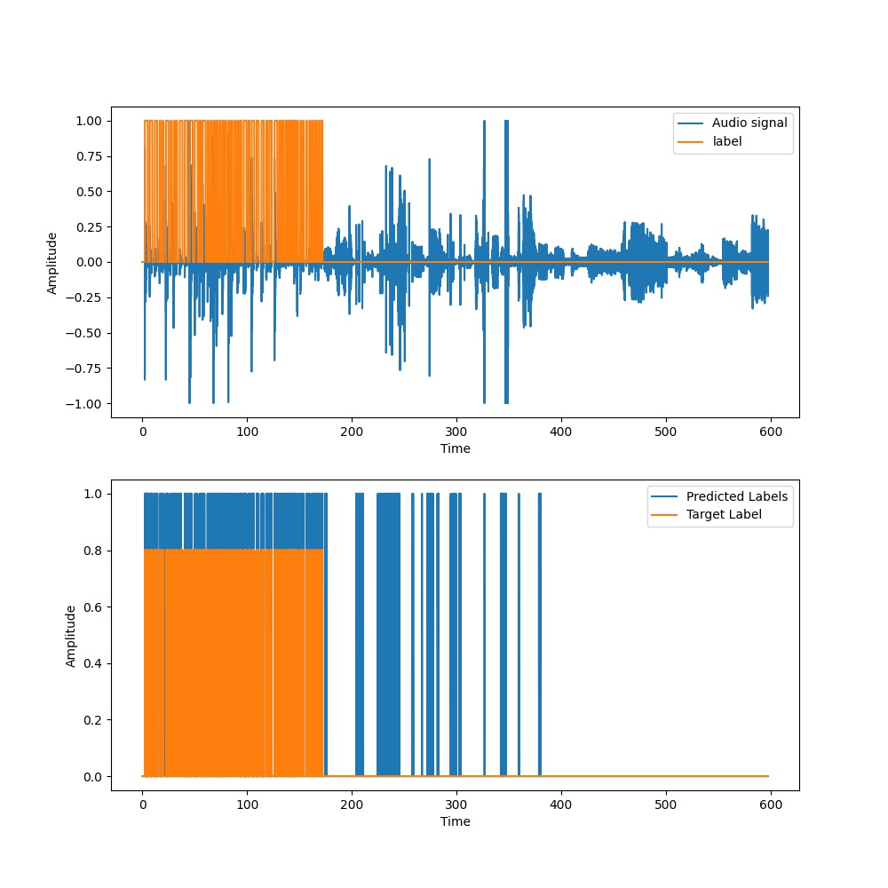
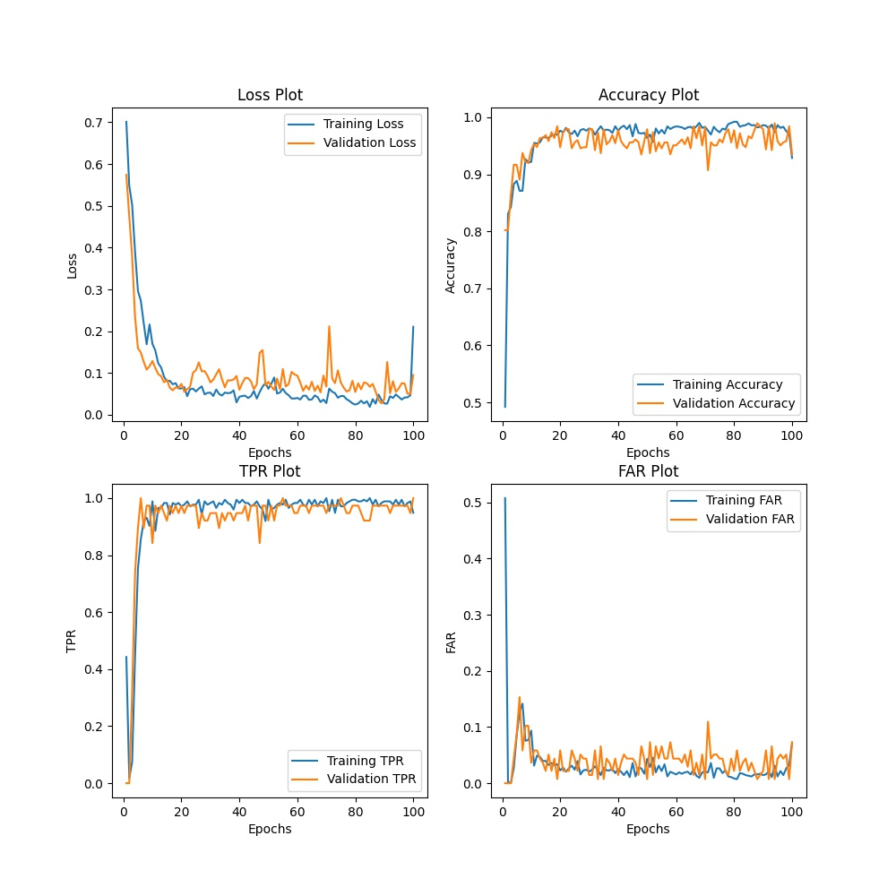
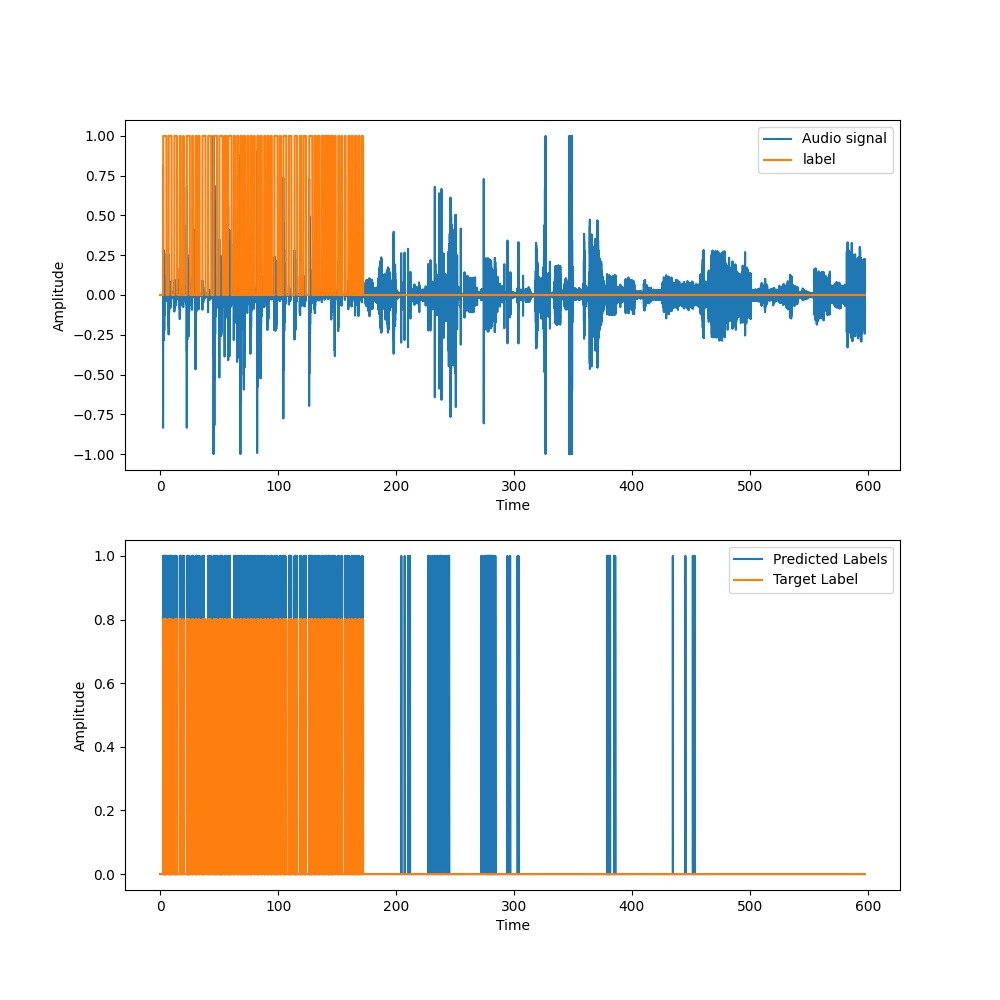
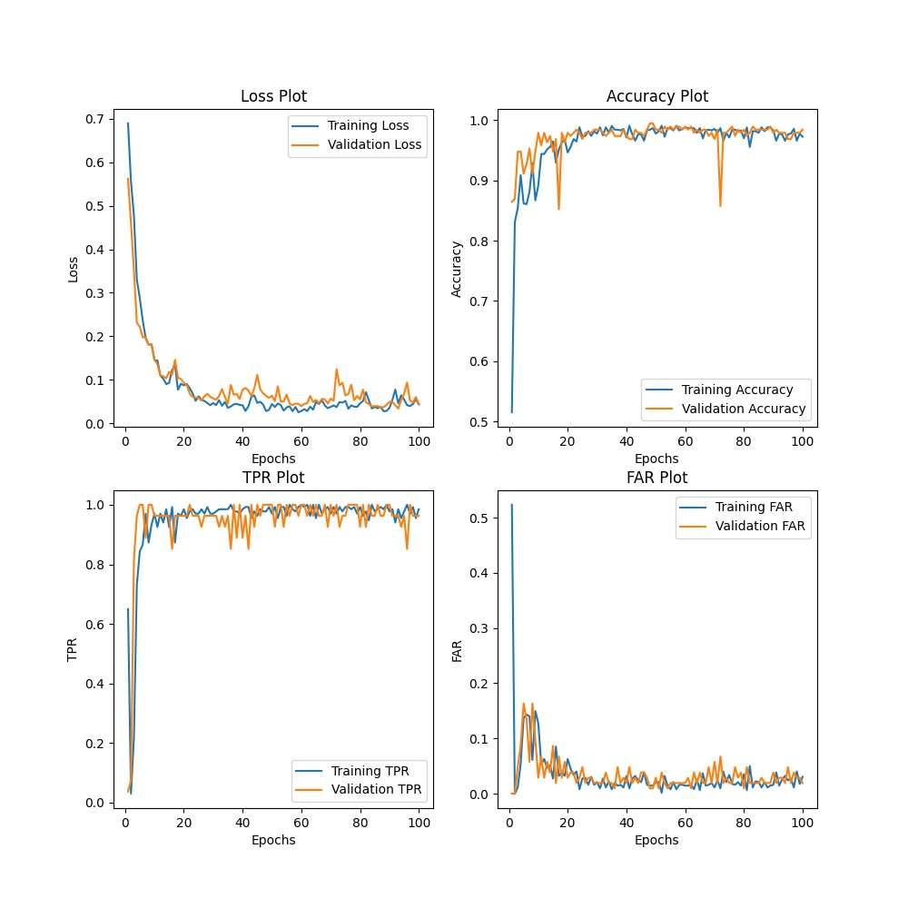

Metrics | T = 50ms, N = 100 | T = 100ms, N = 200 | T = 150ms, N = 250 | T = 200ms N = 350
:------:|:-----------------:|:------------------:|:------------------:|:----------------:
Loss | 0.32096 | 0.34215 | 0.27019 | 0.25050
Accuracy | 0.94134 | 0.93567 | 0.93973 | 0.93683
TPR | 0.68914 | 0.86577 | 0.83266 | 0.90860
FAR | 0.02303 | 0.05491 | 0.04593 | 0.05974
Event based TPR | 0.98 | 1.0 | 1.0 | 1.0
Average Latency(s) | 0.06216 | 0.05869 | 0.11469 | 0.10069

<table>
  <tr>
    <td>T = 50ms, N = 100</td>
     <td>T = 50ms, N = 100</td>
  </tr>
  <tr>
    <td></td>
    <td></td>
  </tr>
 </table>
 
 <table>
  <tr>
    <td>T = 100ms, N = 200</td>
     <td>T = 100ms, N = 200</td>
  </tr>
  <tr>
    <td></td>
    <td></td>
  </tr>
 </table>
 
 <table>
  <tr>
    <td>T = 150ms, N = 250</td>
     <td>T = 150ms, N = 250</td>
  </tr>
  <tr>
    <td></td>
    <td></td>
  </tr>
 </table>
 
 <table>
  <tr>
    <td>T = 200ms, N = 350</td>
     <td>T = 200ms, N = 350</td>
  </tr>
  <tr>
    <td></td>
    <td></td>
  </tr>
 </table>
