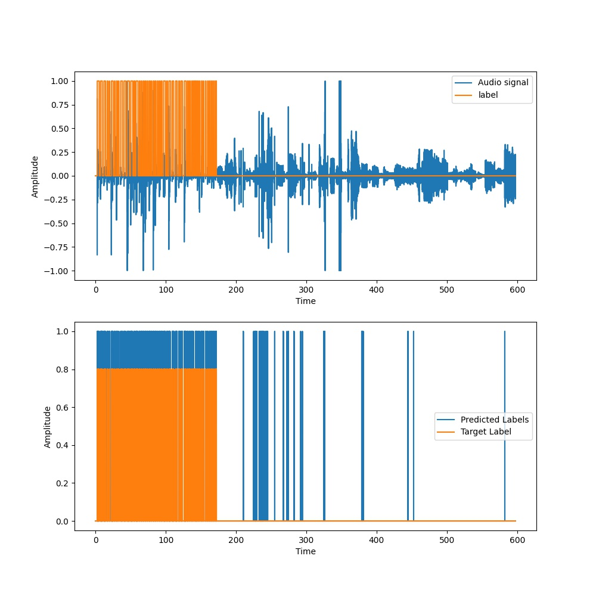
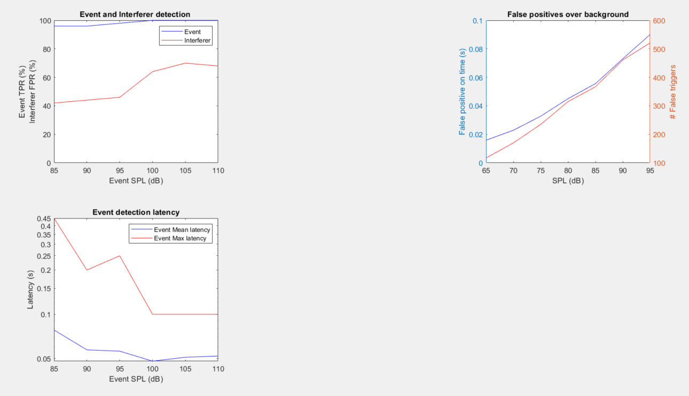

The plots obtained from testing the model on local testset and standard testsuite are as seen below.

The result from local dataset are:
1. A plot of the original audio signal along with the label
2. A plot of the predicted label along with target label

The result from the standard testsuite are:
 1. A plot of accuracy for interferers and events over different SPL levels.  
 2. A plot of latency for interferers and events over different SPL levels.
 3. A plot of FAR for background over different SPL levels.
 
 
<table>
  <tr>
    <td>Result on local testset</td>
     <td>Result on Standard testsuite</td>
  </tr>
  <tr>
    <td></td>
    <td></td>
  </tr>
 </table>
 
From the plot we can see that the accuracy is around 95% in case of events for lower SPL and 100% for higher SPL. In case of interferes it's around 40% for lower SPL and 65% for higher SPL.  
The latency is around 80ms for lower SPL and 50ms for higher SPL. This however needs to be improved in the future.  
The number of false triggers are about 100 for lower SPL and 500 for higher SPL. This also needs improving but it must be done without increasing the latency.  
In general, this model performs well on the standard testing data. 
