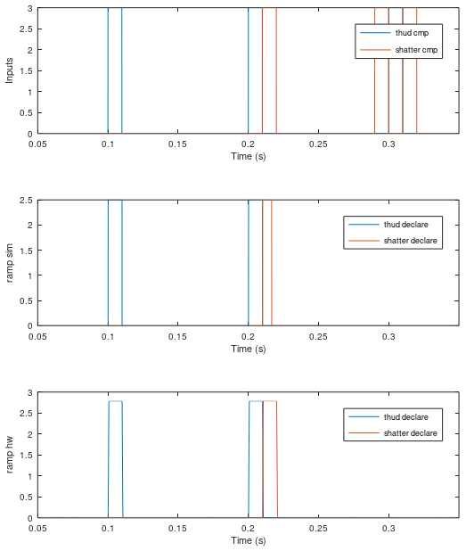

# Timing logic verification

Quick verification of the timing logic circuit operation in ramp sim vs ramp hw. Am seeing matching results. This was done without any trim or anything using the netlist from the `v0_basic-validation` netlist.

