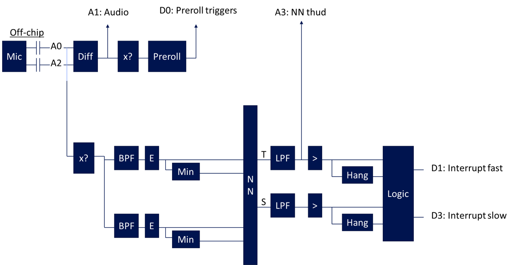

# Tie everything together for the initial parts delivery

* Keep the feature chains simple
  * No ZCR
  * No log
  * 2 bands
* Include the diffamp and preroll

## Steps
* **Done** Mic provide a different dc bias and cut the gain
* **Done** Is the trim_script centering the signal correctly given how large it is?
* **Done** Add other features: log, zcr, ...
* **Done** Get a better answer on the target signal chain
* **Expanded a little, but may want to revisit** Setup training set: incorporate findings from Ring's tests
* **It does** Why doesn't the thud respond?
* Revisit test signal level and gain distribution
* Need to characterize the parts we are sending
* Trim
* Check preroll

## First trim
* The preroll tests broke with the diff amp in the preroll path because A3 was used
  * Fixed by making preroll use the inPos instead
* The thud\_cmp and shatter\_cmp were nominally above threshold, so increased these thresholds by about 50mV
* Going directly from the overhang to the CLB was causing the NN to oscillate, so put an inverter in between to edgify
* Something is pulling down pin A2 on the EM2 board. This is preventing mic interface testing. Am just using
  as single ended.
  * **Dug in in detail and couldn't find a problem. It is working now. Maybe IC wasn't seated well in socket**
* With glass break tester, first try was detecting to about 4 ft away. Came back a few min later and it wasn't 
  detecting. Reprogrammed and was only detecting to about 2ft.
* Did some level captures
* vddLoc is only used for pfets that can be biased with FG, should just use FG?

Open items before next trim
* Adjust test signal scale? **Based on mic recordings, think should not apply the -8dB scale when setting up**
* Review the captures **Decide to add gain and increase peak detector attack**
* What to do about the NNs nominally below comparison threshold?
* **Handled** Incorporate netlist changes to the main gb\_netGen (inverter before CLB, remove vddLoc?)
* **Handled** Don't really want resistor based gain for preroll
* **Handled** Increase 1k and 400 peak detector attack--maybe reduce decay
* **Handled** Reduce peak detector decays
* **Handled** Apply gain before 1k and 400hz

## Second trim
Notes
* 4k peak detector was overdoing the attack, maybe also in all of the bands
* Thud
  * NN test is drifting and unresponsive
  * Looks decent in LPF but attenuated
  * Cmp matches pretty well but with extra triggers
* Shatter
  * W/ LPF is attenuated
  * Cmp is stuck high

| Netlist                              |                                                                  mV |
|--------------------------------------|---------------------------------------------------------------------|
| Empty                                |                                                                0.15 |
| Add references/registers             |                                  0.16 (2.7 w/ extra vdd in netlist) |
| Add mic pins & preroll output buffer |                                                                0.17 |
| Add 3x amp                           |                                                                0.26 |
| Add 4k features                      |                                                                0.31 |
| Add 1k features                      |                                                                0.33 |
| Add 400 features                     |                                                                0.36 |
| Add NN layer 1                       |                                                                0.41 |
| Add NN layer 2                       |                                                                0.45 |
| Add NN output layer                  |                                                                0.47 |
| Add thud/shatter output filters      |                                                                0.47 |
| Add thud/shatter comparators         |                                                                0.62 |
| Add thud/shatter overhang            |                                                                0.65 |
| Add timing logic                     | 3.5[all], needed to change to vdd registers to get clb down to 0.66 |
| Add preroll (no clb)                 |                                                                0.86 |
| Add preroll clb                      |                                                                0.87 |
| Add diffamp and pins                 |   0.91 (can step to 1.5, w/ or w/o pins, but not w/o preroll logic) |
|                                      |                                                                     |

Do something about the extra vdd/gnd register in the netlist, it is causing the power to be higher
Need to remove n/c's on CLB inputs? **no**
Removed the bias point for the audio output
Replaced pfets w/ pseudos
Preroll logic is causing static power: not so sure now, might be a lot of switching power though? **problem was had disabled the diffamp and didn't have a defined input**

* **Done** Step through everything to get the power consumption of different parts

Incorporate **done**
* Back off on peak detector attack: 4k, 1k or get a better way to trim or don't trim
* Increase peak detector decay
* Option to detect increase in NN output rather than given level
* Get rid of the extra vdd/gnd registers
* Remove bias point for audio output
* replace pfets w/ pseudos

Ran trim
* SW issues with the implementation of comparator that used psuedo - took awhile to figure out the error message, but working now. Basically the trim routine expected to see a terminal called "vdd" on the comparator.
* Looks good: Idd ~ 0.83mV. Preroll & detections working w/o manipulation.

Characterize over standard dataset

Assessment
* **68:** Looks pretty good at 5. Looks pretty good with a fully centered implementation as well, maybe a little sensitive
* **66:** Looks good at 0, maybe a bit sensitive. Looks good at 5. Fully centered didn't work at all.
* **64:** Looks good at fully centered, maybe not quite sensitive. Looks good at 5. Looks good at 0
* **67:** Didn't work at 5. Also didn't work at 0. Setting aside.

After next trim
* Tests leaving it running
* Tests w/ gb tester again
* Characterize over standard dataset
* Firmware
* Analyze part-to-part spread and where we need to apply corrections
* Document
* Videos to send? Can we send a setup they can use for quick verify?
* Run with preroll reconstruction
