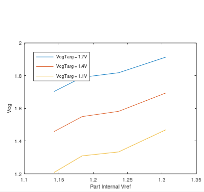

# Part 72

**Cut to last section for the findings, am keeping the process below for reference**

This is the part that we used during the firmware development. It had been trimmed for glass break.
But after doing the firmware development, it seems like it is in a bad state. Am putting it through
its paces to try and understand.

```octave
ramp_ic.info.periph.ref.en_volt.val = 0;
ramp_ic.info.periph.ref.ext_volt.val = 1;

vcg = 1.1;
net = [];
net{end+1}=ramp_ic.pin.vcg({ ...
  'net',{'3','vcg'}, ...
});
net{end+1}=ramp_ic.pin.Iref({ ...
  'net',{'ref','vcg'}, ...
});
net{end+1}=ramp_ic.dev.pmir({ ...
  'loc',[2 0], ...
  'net',{'out','vcg'}, ...
  'bits',{'inSrcSign',1,'outSrcSign',1}, ...
  'nvm',{'outSrc','Vcg',vcg,'vcg3'}, ...
});
net{end+1}.nvmRef={3,2,0,'pmir_outSrc',1.7,3.5e-08,};

net{end+1}=ramp_ic.pin.A1({ ...
  'net',{'out','vcg'}, ...
});
ramp_compile(net, ramp_ic);
```

Using above I switched between a few different vcg values and a few different FG devices. They are all
behaving the same and predictably. They basically seem to work, except with a ~0.5V shift up from what they
should be. So this does not look like overinjection or overtunneling.

What else could be happening? 
- If its a 0.5V high, that could mean that the reference current is too low? No, it looks good
```octave
ramp_library;
net = [];
% Handle normal array vcg such that compilation works
net{end+1} = ramp_ic.pin.vcg({'net', {'3', 'mid'}});
net{end+1}.nvmRef = {3, ...              % vcgNum
                     2, ...              % stage
                     0, ...              % channel
                     'pmir_outSrc', ...  % nvm type
                     1.7, ...            % Vcg target
                     25e-9*1.4};         % reference current
net{end+1} = ramp_ic.pin.Iref({'net',{'ref','ref'}});    % 25nA ref current drain termination
net{end+1} = lib.prim.resi('mega', 'ref', 'kilo', 'r1', 'loc', [0 1]);
net{end+1} = lib.prim.resi('mega', 'r1', 'kilo', 'r2', 'loc', [0 2]);
net{end+1} = lib.prim.resi('mega', 'r2', 'kilo', 'r3', 'loc', [0 3]);
net{end+1} = lib.prim.resi('mega', 'r3', 'kilo', 'r4', 'loc', [0 4]);
net{end+1} = lib.prim.resi('mega', 'r4', 'kilo', 'r5', 'loc', [0 5]);
net{end+1} = lib.prim.resi('mega', 'r5', 'kilo', 'r6', 'loc', [0 6]);
net{end+1} = lib.prim.resi('mega', 'r6', 'kilo', 'mid', 'loc', [0 7]);
net{end+1} = lib.pin.A1('net', 'ref', 'dir', 'out');
ramp_compile(net, ramp_ic);
% Test: Verify ~0.85V at A3
```

- Is the internal reference way off? _Reading 1.3V_
```octave
ramp_ic.info.periph.ref.en_volt.val = 1;
ramp_ic.info.periph.ref.ext_volt.val = 0;

net = [];
net{end+1}=ramp_ic.pin.A1({ ...
  'net',{'out','mid'}, ...
});
ramp_compile(net, ramp_ic);
```

External reference
```octave
ramp_ic.info.periph.ref.en_volt.val = 0;
ramp_ic.info.periph.ref.ext_volt.val = 1;

net = [];
net{end+1}=ramp_ic.pin.A1({ ...
  'net',{'out','mid'}, ...
});
ramp_compile(net, ramp_ic);
```

| Part | Internal ref | Vcg @ 1.7V | Vcg @ 1.4V | Vcg @ 1.1V | External Ref | Iref thru R |
|------|--------------|------------|------------|------------|--------------|-------------|
|   75 | 1.143V       | 1.703V     | 1.458V     | 1.208V     | 1.011V       | 0.844V      |
|   74 | 1.184V       | 1.79V      | 1.55V      | 1.31V      | 1.016V       | 0.848V      |
|   73 | 1.237V (osc) | 1.818      | 1.582V     | 1.334V     | 1.008V       | 0.8248V     |
|   72 | 1.306V       | 1.914V     | 1.695V     | 1.47V      | 1.024V       | 0.8317V     |

Conversions
```octave
Vref = [1.143 1.184 1.237 1.306];
Vcg = [1.703 1.79 1.818 1.914; ...
       1.458 1.55 1.582 1.695; ...
       1.208 1.31 1.334 1.47];
plot(Vref, Vcg');
xlabel('Part Internal Vref'); ylabel('Vcg'); 
legend('VcgTarg = 1.7V', 'VcgTarg = 1.4V', 'VcgTarg = 1.1V', 'Location', 'NorthWest');
```

# Findings
So part 72 doesn't have anything wrong with it per say. It's internal reference is on the high side. 
And since the MSP430 firmware (I've recently found) uses the internal reference when it programs the 
floating gates, this has resulted in part 72 having a high Vcg value. Verified this by measuring four
parts. You can see how the Vcg value varies with the part's internal reference voltage. All of the
FGs are programmed relative to a reference floating gate, so these variations aren't so bad. But this
does cause a slope error in the DAC codes.


   
The reference figures into the programmed value as follows
- Reference is scaled by 2 to create the bottom of the DAC resistor string
- The top of the DAC resistor string connects to the injection voltage, which is 5.1V based on zener diode
- So any error on the reference gets doubled as an offset error but also creates a gain error
