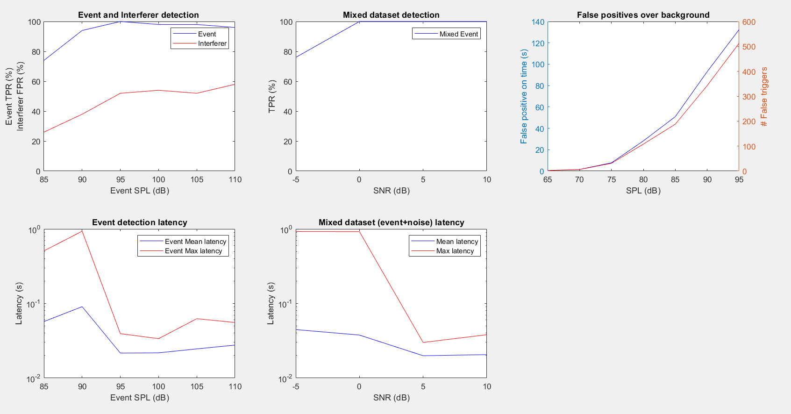
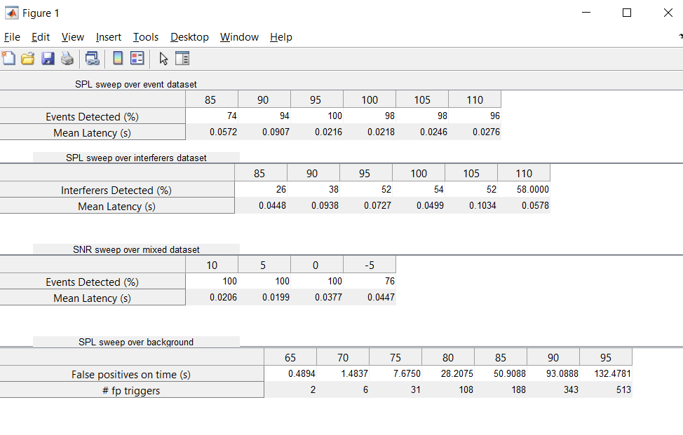

# Glassbreak TestSuite

The folder contains all required files to run glassbreak algorithm on various tests.
* `test_testSuite.m:` is an example program to show the usage of the tester program. 
* `GB_Test_Suite.m:` Iterates through multiple test cases sweeping through varying SPL and SNR levels for the test dataset provided to obtain a variable
containing the required results. 
* `GB_Test_Suite_Results.m:` Uses the result variable to generate tables and graphical plots to illustrate the results. 


## Additional information on files and its usage

### Tester program usage
[test_testSuite.m](test_testSuite.m) is an example program to use the tester. It runs a glassbreak chain on various test benches designed which calls [GB_Test_Suite.m](GB_Test_Suite.m) and [GB_Test_Suite_Results.m](GB_Test_Suite_Results.m). These functions make use of programs inside [src/](../src/) as part of testing and is required to be added to path while using the tester. An example snippet is provided to include [src/](../src/) and [glassbreak_testsuite/](../glassbreak_testsuite/) paths to your base working directory so you can run this tester from any working directory.

```
base = 'PATH/TO/glassbreak/scripts/';
addpath([base '/src']);
addpath([base '/glassbreak_testsuite']);
```

Create or use a signal chain that has been designed to test.
```
Chain=ramp.ops.peak()
``` 

Add paths (dropbox path/relative path; cloud not supported currently) to the test dataset (for event, interferer and noise) inside the **datapath** structure. SPL and SNR levls to sweep through the dataset are also added to the **datapath** structure.
```
datapath.eventset = '%AspBox%\engr\sig_proc\Signal_Library\Audio_Signals\Acoustic_Events\Glass_Break\Dataset\test_dataset_glassbreak.json';
datapath.interfererset = '%AspBox%\engr\sig_proc\Signal_Library\Audio_Signals\Acoustic_Events\Glass_Break\Dataset\test_dataset_disturbers.json';
datapath.noiseset = '%AspBox%\engr\sig_proc\Signal_Library\Audio_Signals\Acoustic_Events\Glass_Break\Dataset\test_dataset_background.json';
datapath.event_spl_array = [85:5:110];
datapath.snr_array = [-5,0,5,10];
datapath.noise_spl_array = [65:5:95];
```
Call [GB_Test_Suite.m](GB_Test_Suite.m) to iterate through all the designed test cases and store the result variable if required. 

```
res = GB_Test_Suite(ramp, 'test', Chain, speed, post_process, datapath);
```

Arguments to this program are explained as follows:
 * **ramp:** Ramp operator used to evaluate the performance while computing the result variable. 
 * **'test':** is the name used to identify this test. (Yet to be incorporated inside the variable to identify) 
 * **Chain:** Model chain used/developed for testing 
 * **speed:** Parameter to shorten test. Value 1 implies full test is run. (Yet to incorporate this variable to pick amount of test) 
 * **post_process:** Value 1 to apply sweeps over thresholds and integration rates (for evaluating signal chains). Value 0 to simply compare with default threshold and integration rates. 
 * **datapath:** structure containing paths to event, interferer, background datasets, SPL and SNR arrays to sweep the data 

Finally call [GB_Test_Suite_Results.m](GB_Test_Suite_Results.m) to visualize the results in tabular or graphical forms. 

```
table = GB_Test_Suite_Results(res, res_plot, res_table);
```

Arguments to this program are explained as follows:
 * **res:** The output result variable obtained in the previous line 
 * **res_plot:** Value 1 if graphical illustration of results is required, else value 0 can be provided. 
 * **res_table:** Value 1 if tabular illustration of results is required, else value 0 can be provided. 

Function also has a fourth argument **success_thresholds**, a structure containing baseline or required results which is plot/marked separately in the illustration in order to compare with the results obtained. The usage for this is found inside the example code [test_testSuite.m](test_testSuite.m) which uses [setup_success_thresholds.m](setup_success_thresholds.m) to setup default thresholds. Any desired change to these default thresholds can be made to the structure by referencing it after the initial default setup. 

The following are the illustrations of an example model run through this testsuite. 

<table>
  <tr>
    <td>Graphical result</td>
     <td>Tabular result</td>
  </tr>
  <tr>
    <td></td>
    <td></td>
  </tr>
 </table>

### Glassbreak tests performed
[GB_Test_Suite.m](GB_Test_Suite.m) performs four main tests to accumulate results.
- Event SPL sweep: Sweeps through provided SPL levels of the events in the glassbreak dataset (eg: from 85 dBSPL to 110 dBSPL in steps of 5 dBSPL) and tests for detection (true positive rate and latency).
- Interferer SPL sweep: Sweeps through provided SPL levels of the interferers in the disturbers/interferers dataset (eg: from 85 dBSPL to 110 dBSPL in steps of 5 dBSPL) and tests for detection (false positive rate and latency). However this currently tests for detection for only 1 second after the start of interferer label and doesn't consider longer interferers. (Needs a fix)
- SNR swwep: Sweeps through provided SNR levels (eg: -5, 0, 5, 10) across selected mixture of event+background files containing the particular SNR, given the glassbreak is at 94dBSPL and tests for detection (true positive rate and latency)
- FAR sweep: Sweeps though SPL levels of background in the noise dataset (eg: from 65 dBSPL to 95 dBSPL in steps of 5 dBSPL) and tests for false positives being detected (FP detection on time as well as number of false triggers) 
